# **Packet Analysis and Traffic Filtering with Wireshark - Group D15**

## Table of Contents

1. [Addressing :mailbox:](#addressing)
   1. [Question 1](#question-1)
   2. [Question 4](#question-4)
   3. [Question 6](#question-6)
2. [Stream :wavy_dash:](#stream)
   1. [Question 2](#question-2)
   2. [Question 10](#question-10)
3. [Analysis :nerd_face:](#analysis)
   1. [Question 3](#question-3)
   2. [Question 5](#question-5)
4. [Filtering :checkered_flag:](#filtering)
   1. [Question 7](#question-7)
   2. [Question 8](#question-8)
   3. [Question 9](#question-9)

## Addressing

### Question-1

**The user performs various activities using the FTP protocol. One of them is uploading a file.**

_Solution_

From the question above, we know that we need to filter using a display filter for the FTP (File Transfer Protocol) protocol based on the keyword "uploading a file", and then filter within the FTP protocol results using the keyword for uploading a file, which is "STOR" (the FTP file upload command).

Here are the step-by-step instructions:

Open Wireshark and open the file `soal1.pcapng`

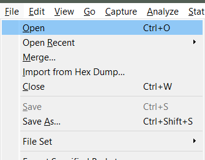
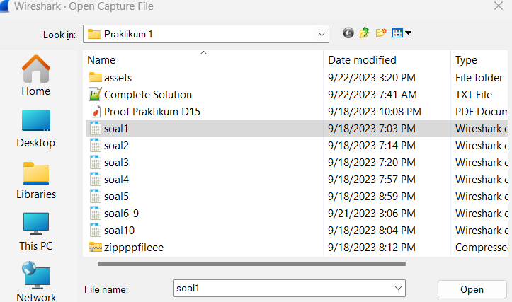

The following interface will appear:
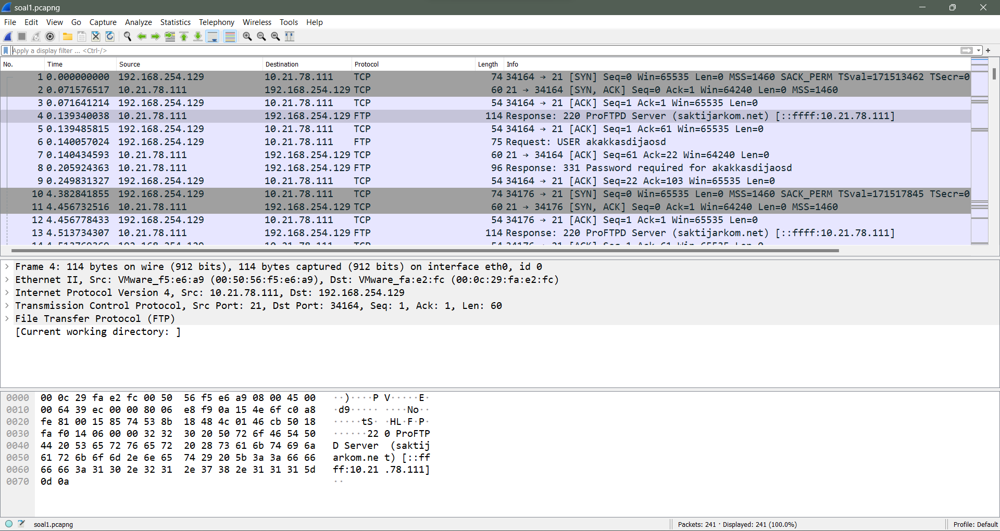

Then apply a display filter with the keyword "ftp" to filter FTP request-response traffic:

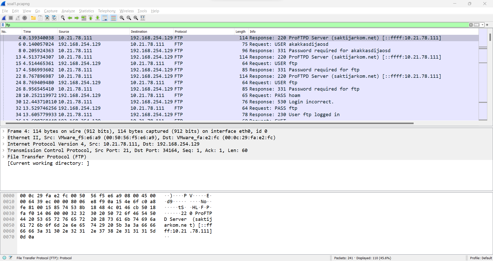
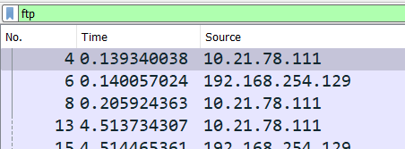

After that, from the FTP display filter results, search the packet list with the keyword "STOR" which indicates a file upload:

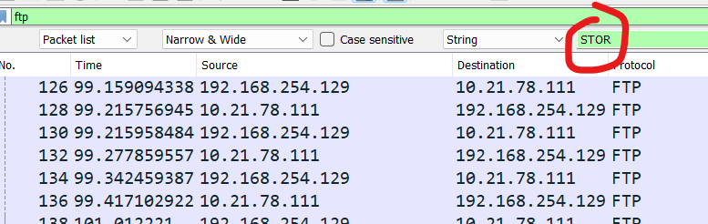

<strong>Question point a</strong>: What is the sequence number (raw) on the packet showing this activity?

From this packet, we analyze its sequence number at the TCP (Transmission Control Protocol) layer:

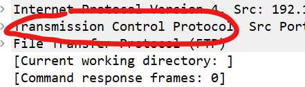

We will obtain the sequence number (raw) of the packet:

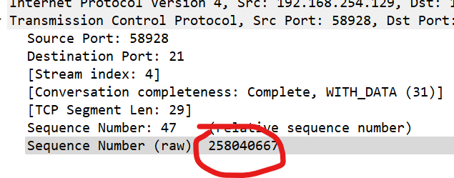

After opening the netcat question prompt, if we answer question point a with the sequence number (raw) obtained above, the following result is displayed:

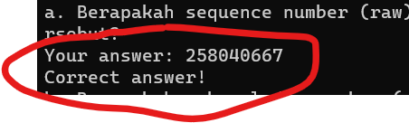

<strong>Question point b</strong>: What is the acknowledgment number (raw) on the packet showing this activity?

From the TCP layer inspected previously, we also obtain the acknowledgment number (raw) as follows:

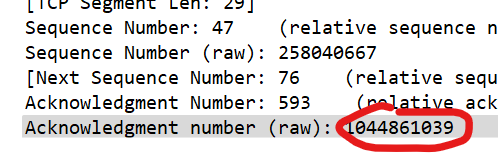
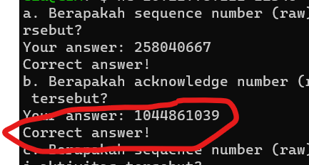

<strong>Question point c</strong>: What is the sequence number (raw) on the packet showing the response to this activity?

From packet 147 (which contains the file upload request using FTP), we can find the response packet directly below it (after filtering for FTP), which is packet 149:

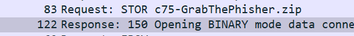

This can be confirmed by verifying that the source and destination of both packets match each other as follows:

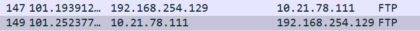

From there, we obtain its sequence number (raw) by checking the TCP layer of the packet under the sequence number (raw) field. When checking it using netcat for point c, we get the following result:

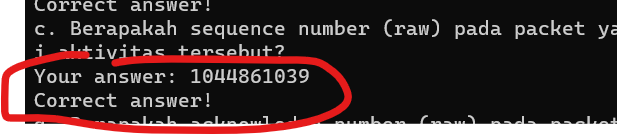

<strong>Question point d</strong>: What is the acknowledgment number (raw) on the packet showing the response to this activity?

Inspecting the ACK number of that packet gives us the following value:

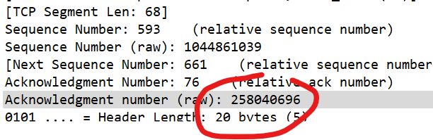

And when checking it with netcat:

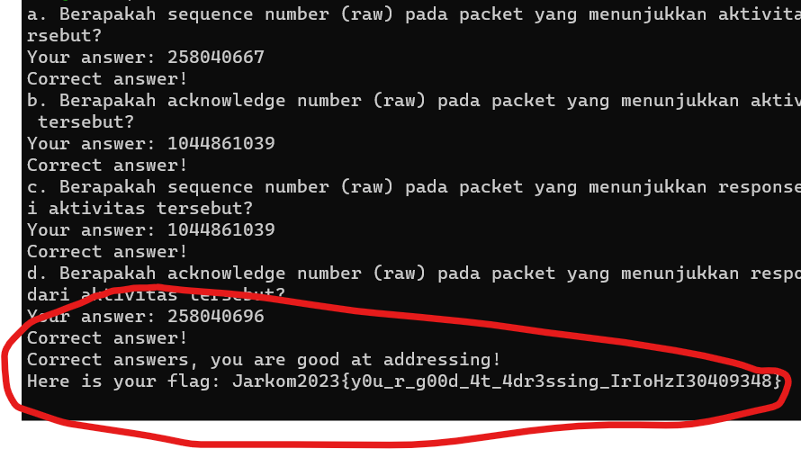

Voila! We got the correct answer and the flag.

### Question-4

**What is the checksum value obtained from the header of packet number 130?**

_Solution_

To find the checksum value obtained from the header of packet number 130, we access that packet and directly inspect the header under the UDP section.

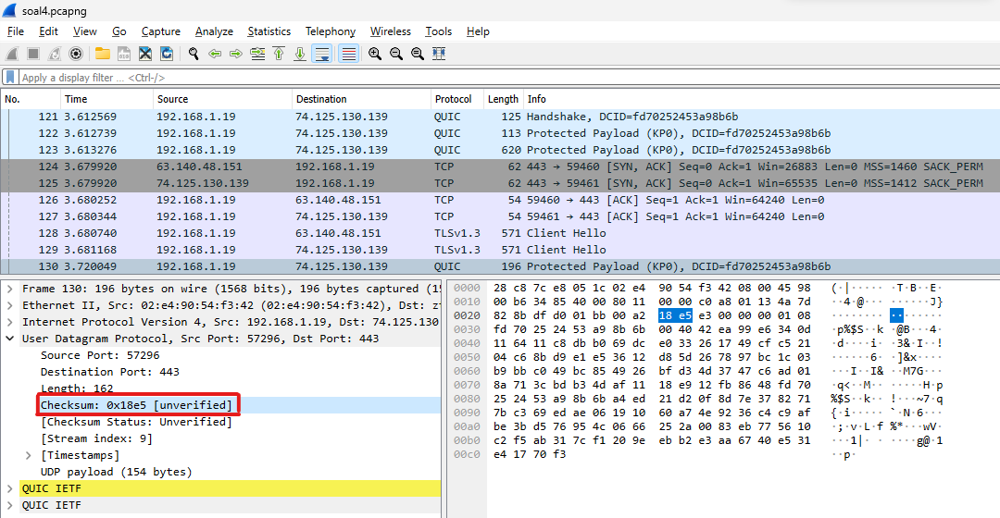

From there, we find that the _checksum_ value is <ins>**0x18e5**</ins>

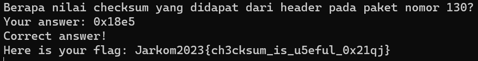

### Question-6

**A boy named Udin is friends with SlameT, who is a fan of detective movies. As a good friend, he always invites Slamet to play valoranT together. One night, an unexpecteD event occurred. When they opened the game, Udin's laptop displayed a text field and an Invalid code reading _"server SOURCE ADDRESS 7812 is invalid"_. When searched on Google, the search results only showed a1 e5 u21. Slamet's detective instincts kicked in. Help Udin and Slamet find the solution to this error code.**

_Solution_

After analyzing the puzzle in the question, here are the key clues:

- There is a substitution cipher: a1z26 Cipher
- The letter range used in the cipher result is letters A-R, numbers 1-18, resulting in a 6-letter answer.
- Check the source IP on packet 7812 from the pcap file.

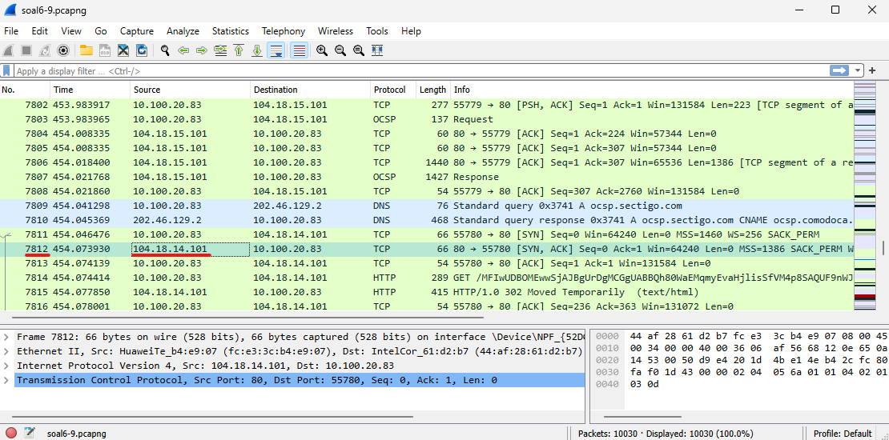
From there, it can be seen that the source IP on packet 7812 is <ins>104.18.14.101</ins>

After that, opening the <a href="https://www.dcode.fr/letter-number-cipher">_a1z26 cipher decoder_</a> and entering the numbers from the IP yields the answer.

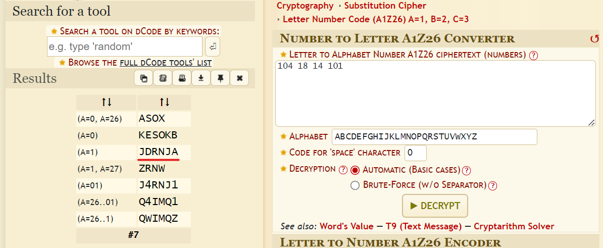
It can be seen that the cipher decode results from the source IP of packet 7812 vary, but choosing the one with 6 letters gives the answer: _**JDRNJA**_.

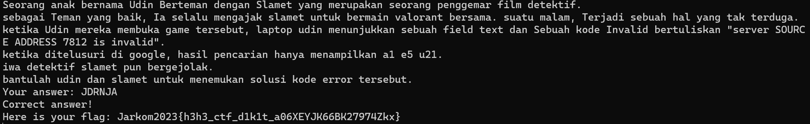

## Stream	

### Question-2

**Identify the web server used on the Computer Networks practicum portal!**

_Solution_

From the question, we know that a web portal is an HTML file served over the HTTP protocol, so we apply an HTTP display filter for this question.

Step-by-step instructions:

First, open `soal2.pcapng`, then apply an HTTP display filter as follows:

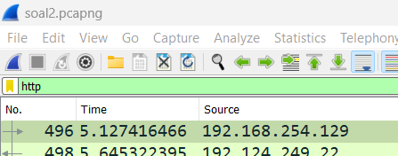

After that, search the <strong>packet list</strong> for "GET / HTTP/1.1" to find the web portal's <strong>request packet</strong>, since portal websites typically use a GET request and the root folder "/" as follows:

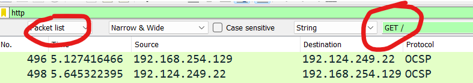

From the IP obtained as follows:

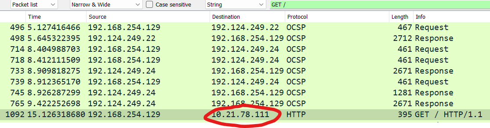

We then filter the destination IP of that request, but filter it as the source IP here because we want the response from that IP, as follows:

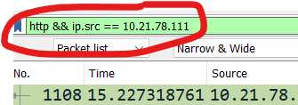

From the filter results, we find several responses, but the one we want is the response with a `text/html` file type because a web portal is an HTML website:

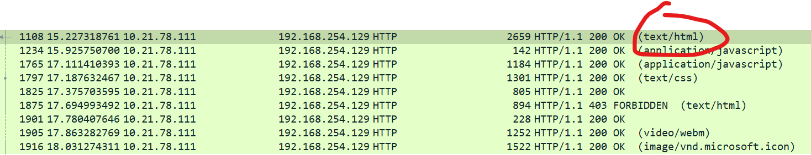

From there, opening the HTTP layer of that packet (packet 1092 [containing the portal website]), we can see the server used by that packet:

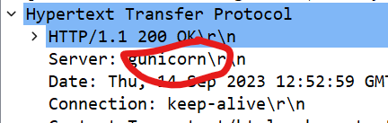

When testing this answer using netcat, we obtain the flag:

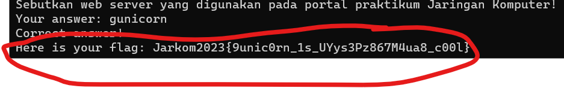

### Question-10

**Identify the correct credentials when the user attempts to log in using Telnet.**

_Solution_

We can find the credentials through the packet where the user logs in by applying the query filter:
```
telnet contains "Login"
```
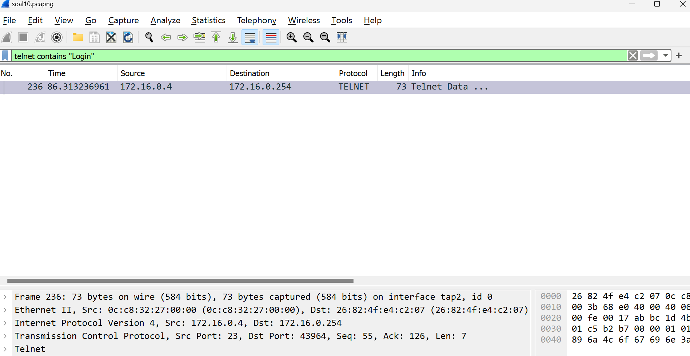

Then follow the TCP Stream:

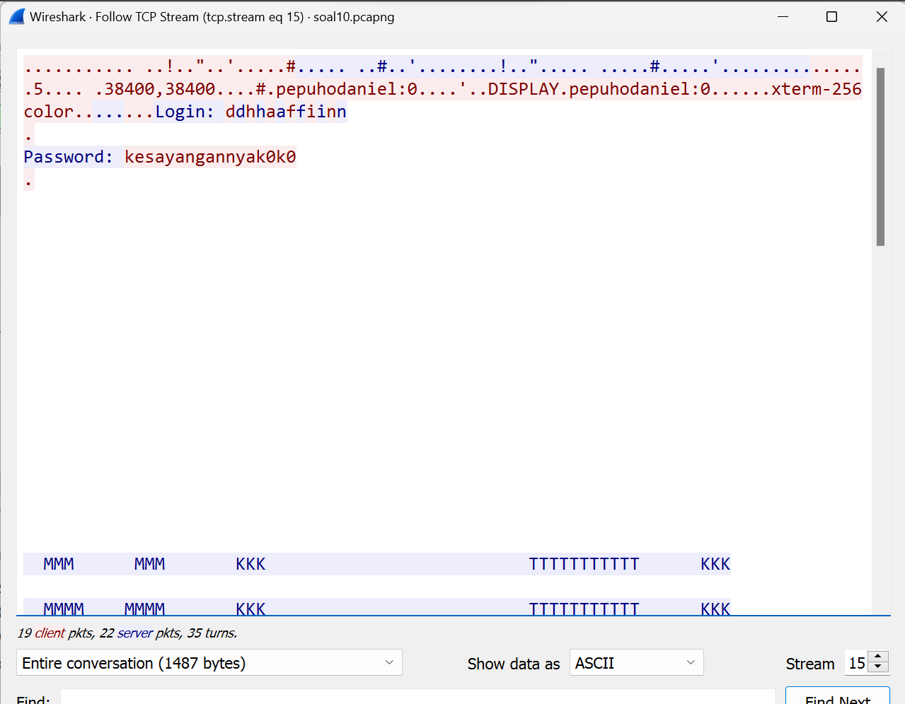

The login information is displayed with the username credential ``ddhhaaffiinn`` (actually just dhafin) and password ``kesayangannyak0k0``.

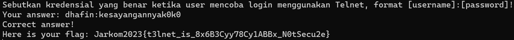

## Analysis

### Question-3

**Dapin is learning network analysis. Help Dapin solve the following questions.**

_Solution_

The first thing to do is open `soal3.pcapng` using Wireshark, then open the netcat program provided via the Linux terminal.

<strong>Question point a</strong>: How many packets were captured where the source or destination IP address is 239.255.255.250 on port 3702?

Based on the point above, we apply the following display filter:

```
ip.addr == 239.255.255.250 && (tcp.port == 3702 or udp.port == 3702)
```

Explanation of the filter above: we capture all IP traffic originating from or destined to `239.255.255.250` with `ip.addr == 239.255.255.250`. Since we also want the filter to include packets to port 3702, and since there are two transport layer protocols (TCP and UDP), we capture all possibilities with `tcp.port == 3702 or udp.port == 3702` and combine them as follows:

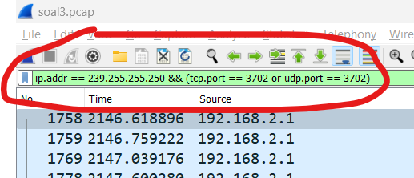

From there, checking the bottom status bar in Wireshark displays the following:

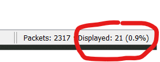

When checking this using the netcat program for point a, the following result is obtained:

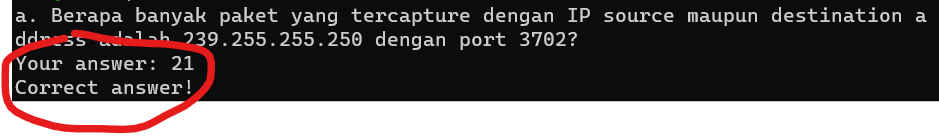

<strong>Question point b</strong>: Which transport layer protocol is used?

From the filter, we only see packets using the UDP protocol:

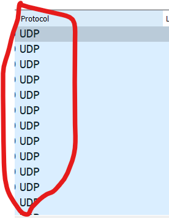

When checking this answer with netcat, we get the flag:

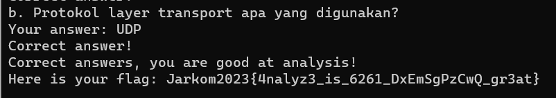

### Question-5

**Elshe found an interesting packet capture file. Help Elshe analyze the packet capture file.**

**a. How many packets were successfully captured from the pcap file?**

**b. Which server port is used for the SMTP service?**

**c. Of all captured IP addresses, which IP is a public IP?**

_Solution_

To unlock the locked zip file on the practicum portal (containing netcat to answer this question), we must find the password located in a packet within the pcap file for question 5.
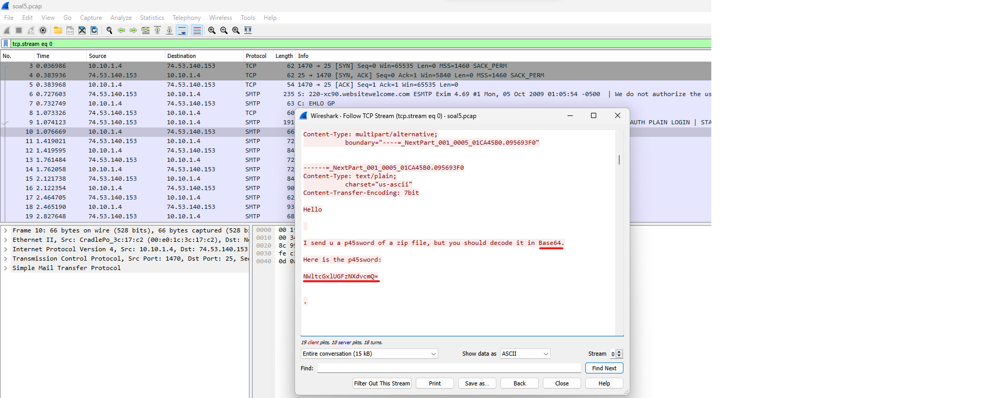
After following the TCP Stream from one of the packets, it is seen that the password is **NWltcGxlUGFzNXdvcmQ=**, which decodes in Base64 to _5implePas5word_.

Afterwards, we answer the questions:

- **How many packets were successfully captured from the pcap file?**
  
  
    There are **60** packets successfully captured from the pcap file.

- **Which server port is used for the SMTP service?**
  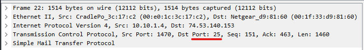
  
    The server port used for the SMTP service is port **25**.

- **Of all captured IP addresses, which IP is a public IP?**

  Public IPs are IPs outside the private IP ranges:

  - 10.0.0.0 — 10.255.255.255
  - 172.16.0.0 — 172.31.255.255
  - 192.168.0.0 — 192.168.255.255

  From the pcap file, the public IP is <ins>**74.53.140.153**</ins>.

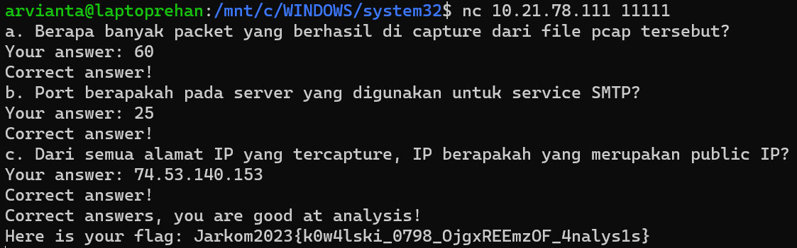

## Filtering 

### Question-7

**How many packets are destined to IP 184.87.193.88?**

_Solution_

To get the number of packets destined to that IP, apply the following filter syntax:
```
ip.dst == 184.87.193.88
```
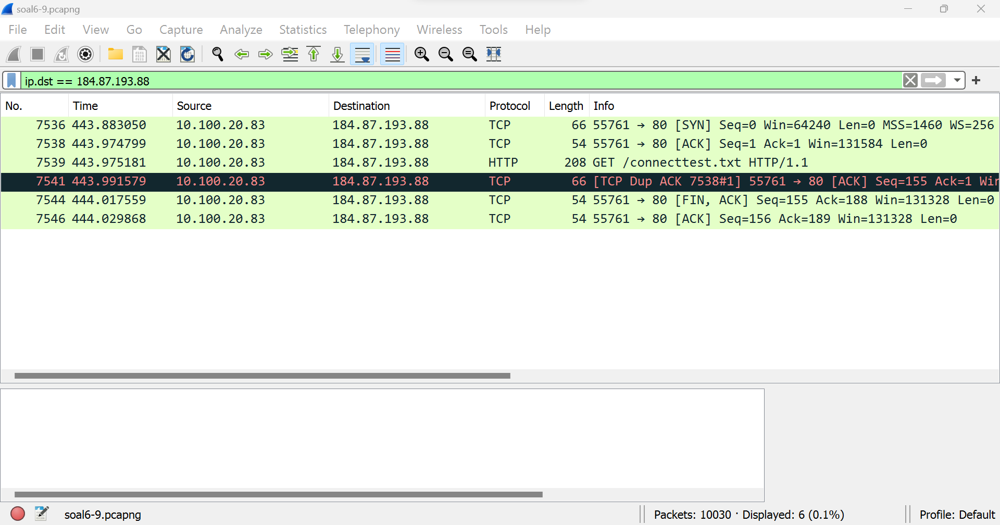

It can be seen that there are **6** packets destined to IP `184.87.193.88`.

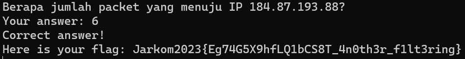

### Question-8

**Provide a filter query so Wireshark only captures all packet protocols destined to port 80! (If there is more than 1 port, sort alphabetically)!**

_Solution_

The first thing to do is open `soal6-9.pcapng` using Wireshark and open the netcat program provided via the Linux terminal.

Then apply a display filter on Wireshark with the following query:

```
tcp.dstport == 80 || udp.dstport == 80
```

Explanation of the filter: we filter packets destined to port 80 with UDP transfer protocol (`udp.dstport == 80`) and TCP (`tcp.dstport == 80`). Because we must sort alphabetically (`t` before `u`) and combine the two queries with `||`, we obtain the query as follows:

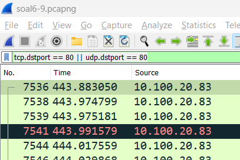

When verifying it using netcat, we obtain the flag:

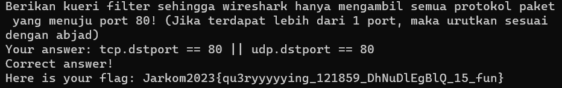

### Question-9

**Provide a filter query so Wireshark only captures packets originating from address 10.51.40.1 but not destined to address 10.39.55.34!**

_Solution_

The first thing to do is open `soal6-9.pcapng` using Wireshark and open the netcat program provided via the Linux terminal.

We apply the following query:

```
ip.src == 10.51.40.1 && ip.dst != 10.39.55.34
```

Explanation of the query: we filter all packets originating from IP 10.51.40.1 with the query `ip.src == 10.51.40.1`, but not destined to IP 10.39.55.34 with `ip.dst != 10.39.55.34`. Since both conditions must be satisfied, we use the logical operator `&&`, resulting in the query as follows:

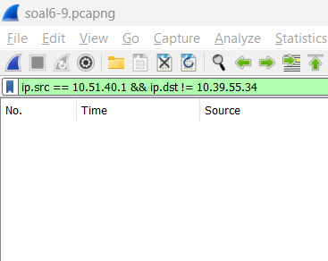

When verifying it using netcat, we obtain the flag:

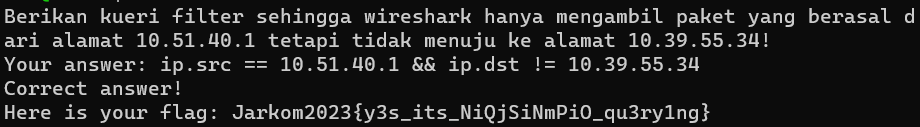
