# **DNS Architecture and Web Server Management with BIND, Nginx, and Apache - Group D15**

## Table of Contents

1. [Questions](#questions)
2. [Topology Setup](#topology-setup)
3. [DNS Setup](#dns-setup)
4. [Web Server Setup (Nginx)](#web-server-setup-nginx)
5. [Web Server Configuration (Apache)](#web-server-configuration-apache)
6. [Bash Scripts](#bash-scripts)

## Questions

1. Yudhistira will be used as the DNS Master, Werkudara as the DNS Slave, and Arjuna is a Load Balancer consisting of several Web Servers: Prabakusuma, Abimanyu, and Wisanggeni. Create a topology according to the following division. The topology folder can be accessed via the following drive.
2. Create the main website on the Arjuna node accessible via **arjuna.yyy.com** with the alias **www.arjuna.yyy.com**, where yyy is your group code.
3. In the same way as question 2, create the main website with access to **abimanyu.yyy.com** and alias **www.abimanyu.yyy.com**.
4. Then, since several websites need to be deployed, create the subdomain **parikesit.abimanyu.yyy.com** whose DNS is configured on Yudhistira and points to Abimanyu.
5. Also create a reverse domain for the main domain. (_Reverse only Abimanyu_)
6. To ensure it remains reachable when the Yudhistira DNS Server has issues, configure Werkudara as the DNS Slave for the main domain.
7. Since a lot of information needs to be received, create a special war subdomain **baratayuda.abimanyu.yyy.com** with the alias **www.baratayuda.abimanyu.yyy.com** delegated from Yudhistira to Werkudara with IP pointing to Abimanyu inside the Baratayuda folder.
8. For more specific information regarding Ranjapan Baratayuda, create a subdomain via Werkudara with access **rjp.baratayuda.abimanyu.yyy.com** with alias **www.rjp.baratayuda.abimanyu.yyy.com** pointing to Abimanyu.
9. Arjuna is an Nginx Load Balancer with three workers (which also use Nginx as web servers): Prabakusuma, Abimanyu, and Wisanggeni. Perform deployment on each worker.
10. Then use the **Round Robin** algorithm for the Load Balancer on **Arjuna**. Use the _server_name_ from question 1. To verify access to the web address, ensure that the worker handling requests alternates accordingly. Web servers on each worker must run on ports 8001-8003. Example:
    - _Prabakusuma:8001_
    - _Abimanyu:8002_
    - _Wisanggeni:8003_
11. In addition to Nginx, configure the Apache Web Server on worker Abimanyu with the web server **www.abimanyu.yyy.com**. First, configure the DocumentRoot at `/var/www/abimanyu.yyy`.
12. After that, change the URL **www.abimanyu.yyy.com/index.php/home** to **www.abimanyu.yyy.com/home**.
13. Additionally, on subdomain **www.parikesit.abimanyu.yyy.com**, DocumentRoot is stored at `/var/www/parikesit.abimanyu.yyy`.
14. On that subdomain, the `/public` folder can only perform _directory listing_, while the `/secret` folder cannot be accessed (_403 Forbidden_).
15. Create custom error pages in the `/error` folder to override error codes in Apache. The error codes to be replaced are 404 Not Found and 403 Forbidden.
16. Create a virtual host configuration so that the asset file path **www.parikesit.abimanyu.yyy.com/public/js** becomes **www.parikesit.abimanyu.yyy.com/js**.
17. For security, configure **www.rjp.baratayuda.abimanyu.yyy.com** to only be accessible via ports 14000 and 14400.
18. To access it, create authentication with username “Wayang” and password “baratayudayyy” where yyy is the group code. Set DocumentRoot at `/var/www/rjp.baratayuda.abimanyu.yyy`.
19. Configure it so that every access to Abimanyu's IP will automatically redirect to **www.abimanyu.yyy.com (alias)**.
20. Because the website **www.parikesit.abimanyu.yyy.com** receives more visitors and many random images, rewrite image requests containing the substring “abimanyu” to point to `abimanyu.png`.

PS:

- **yyy** in URLs represents **your group code** (`d15`)
- Requirement files can be accessed via the provided drive.

## Topology Setup

The topology was created according to the specifications in the problem description, where `NAT1` connects to `Router`, which then connects to two switches, each connected to several nodes. `Switch1` connects to `NakulaClient`, `SadewaClient`, `AbimanyuWebServer`, `PrabakusumaWebServer`, and `WisanggeniWebServer`. Meanwhile, `Switch2` connects to `YudhistiraDNSMaster`, `WerkudaraDNSSlave`, and `ArjunaLoadBalancer`.

> _Answer for Question 1_

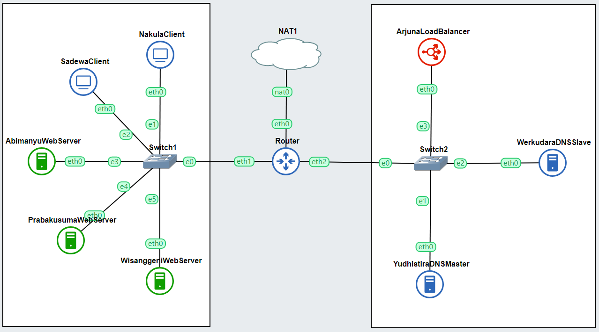

Below is the list of IP addresses for each node in the topology above:

```sh
NakulaClient = 10.29.1.2
SadewaClient = 10.29.1.3
AbimanyuWebServer = 10.29.1.4
PrabukusumaWebServer = 10.29.1.5
WisanggeniWebServer = 10.29.1.6

YudhistiraDNSMaster = 10.29.2.2
WerkudaraDNSSlave = 10.29.2.3
ArjunaLoadBalancer = 10.29.2.4
```

## DNS Setup

DNS will be configured on YudhistiraDNSMaster as well as WerkudaraDNSSlave. The requirements from the questions are as follows:

- Create the main website on node Arjuna accessible via arjuna.yyy.com with alias www.arjuna.yyy.com, where yyy is the group code <span style="color:orange; font-weight:bold;">(Question 2)</span>
- Create the main website with access to abimanyu.yyy.com and alias www.abimanyu.yyy.com <span style="color:orange; font-weight:bold;">(Question 3)</span>
- Create the subdomain parikesit.abimanyu.yyy.com whose DNS is managed on Yudhistira and points to Abimanyu <span style="color:orange; font-weight:bold;">(Question 4)</span>
- Also create a reverse domain for the main domain <span style="color:orange; font-weight:bold;">(Question 5)</span>
- Also configure Werkudara as the DNS Slave for the main domain <span style="color:orange; font-weight:bold;">(Question 6)</span>
- Create a special war subdomain baratayuda.abimanyu.yyy.com with alias www.baratayuda.abimanyu.yyy.com delegated from Yudhistira to Werkudara with IP pointing to Abimanyu in the Baratayuda folder <span style="color:orange; font-weight:bold;">(Question 7)</span>
- Create a subdomain via Werkudara with access rjp.baratayuda.abimanyu.yyy.com with alias www.rjp.baratayuda.abimanyu.yyy.com pointing to Abimanyu <span style="color:orange; font-weight:bold;">(Question 8)</span>

Based on these requirements, we first configure DNS on Yudhistira as the DNS Master.

### Setting DNS Master

> _named.conf.local_ on Yudhistira

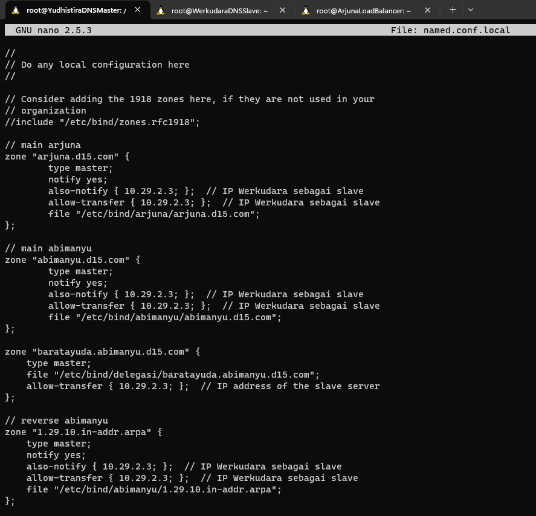

```bind
//
// Do any local configuration here
//

// Consider adding the 1918 zones here, if they are not used in your
// organization
//include "/etc/bind/zones.rfc1918";

// main arjuna
zone "arjuna.d15.com" {
        type master;
        notify yes;
        also-notify { 10.29.2.3; };  // Werkudara IP as slave
        allow-transfer { 10.29.2.3; };  // Werkudara IP as slave
        file "/etc/bind/arjuna/arjuna.d15.com";
};

// main abimanyu
zone "abimanyu.d15.com" {
        type master;
        notify yes;
        also-notify { 10.29.2.3; };  // Werkudara IP as slave
        allow-transfer { 10.29.2.3; };  // Werkudara IP as slave
        file "/etc/bind/abimanyu/abimanyu.d15.com";
};

zone "baratayuda.abimanyu.d15.com" {
    type master;
    file "/etc/bind/delegasi/baratayuda.abimanyu.d15.com";
    allow-transfer { 10.29.2.3; };  // IP address of the slave server
};

// reverse abimanyu
zone "1.29.10.in-addr.arpa" {
    type master;
    notify yes;
    also-notify { 10.29.2.3; };  // Werkudara IP as slave
    allow-transfer { 10.29.2.3; };  // Werkudara IP as slave
    file "/etc/bind/abimanyu/1.29.10.in-addr.arpa";
};
```

In the BIND DNS server configuration file `named.conf.local`, we have configured several DNS zones, including:

1. `arjuna.d15.com`: DNS zone for the **arjuna.d15.com** domain, configured as a master server, notifying the slave server (Werkudara) upon updates.
2. `abimanyu.d15.com`: DNS zone for the **abimanyu.d15.com** domain, also configured as a master server, notifying the slave server (Werkudara) upon changes.
3. `baratayuda.abimanyu.d15.com`: DNS zone for the subdomain **baratayuda.abimanyu.d15.com**, configured as a master server, and zone data for that subdomain is stored in the file.
   - <span style="color:gray; font-style:italic;"> Note: This zone was a workaround because without declaring this zone, the baratayuda subdomain was not read as a delegated subdomain to Werkudara.</span>
4. `1.29.10.in-addr.arpa`: Reverse DNS zone for the IP address range 10.29.1.0/24 used by the abimanyu.d15.com domain, configured as a master server, notifying the slave server (Werkudara) upon changes.

The BIND zone files for each zone are as follows:

> _Arjuna Zone_

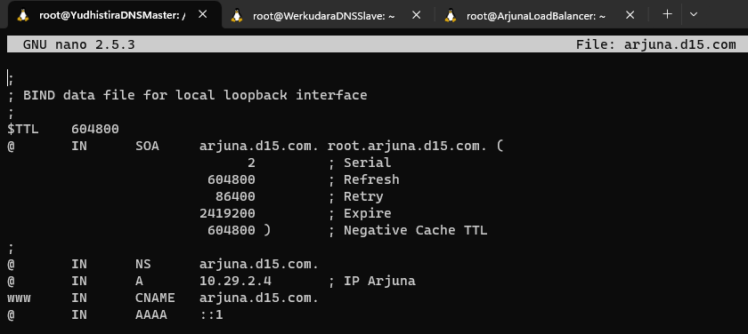

```bind
;
; BIND data file for local loopback interface
;
$TTL    604800
@       IN      SOA     arjuna.d15.com. root.arjuna.d15.com. (
                              2         ; Serial
                         604800         ; Refresh
                          86400         ; Retry
                        2419200         ; Expire
                         604800 )       ; Negative Cache TTL
;
@       IN      NS      arjuna.d15.com.
@       IN      A       10.29.2.4       ; Arjuna IP
www     IN      CNAME   arjuna.d15.com.
@       IN      AAAA    ::1
```

In the first line, **NS (Name Server)** indicates that the authoritative server for this zone is `arjuna.d15.com`. Then, the **A (Address)** record maps the name **@ (root domain)** to the IP address `10.29.2.4`. Additionally, there is a **CNAME** record associating `www` with `arjuna.d15.com`, so accessing `www.arjuna.d15.com` points to `arjuna.d15.com`.

> _Abimanyu Zone_

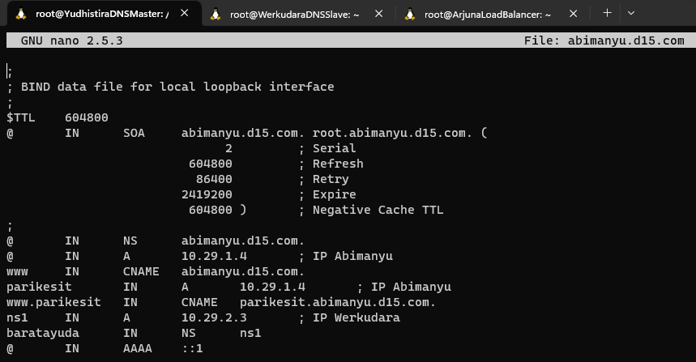

```bind
;
; BIND data file for local loopback interface
;
$TTL    604800
@       IN      SOA     abimanyu.d15.com. root.abimanyu.d15.com. (
                              2         ; Serial
                         604800         ; Refresh
                          86400         ; Retry
                        2419200         ; Expire
                         604800 )       ; Negative Cache TTL
;
@       IN      NS      abimanyu.d15.com.
@       IN      A       10.29.1.4       ; Abimanyu IP
www     IN      CNAME   abimanyu.d15.com.
parikesit       IN      A       10.29.1.4       ; Abimanyu IP
www.parikesit   IN      CNAME   parikesit.abimanyu.d15.com.
ns1     IN      A       10.29.2.3       ; Werkudara IP
baratayuda      IN      NS      ns1
@       IN      AAAA    ::1
```

The **NS (Name Server)** declaration indicates that the authoritative server for this zone is `abimanyu.d15.com`. The **A (Address)** record maps **@ (root domain)** to the IP address **10.29.1.4**. The **CNAME** record maps `www` to `abimanyu.d15.com`. An additional **A** record is defined for **subdomain parikesit** pointing to the same IP address as `abimanyu.d15.com`. The **CNAME** record for `www.parikesit` maps that subdomain to `parikesit.abimanyu.d15.com`. Next, there is a delegation for subdomain `baratayuda.abimanyu.d15.com` with an NS record pointing to `ns1 (Werkudara)`. This allows `baratayuda` to be managed by a separate DNS server (`ns1`). There is also an AAAA record mapping **@** to the **IPv6 loopback address ::1**.

> _Reverse Abimanyu Zone_

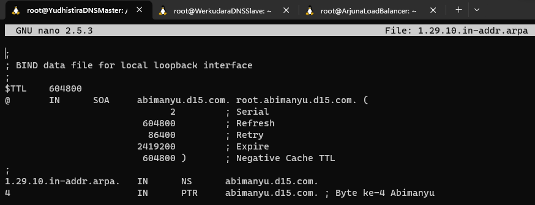

```bind
;
; BIND data file for local loopback interface
;
$TTL    604800
@       IN      SOA     abimanyu.d15.com. root.abimanyu.d15.com. (
                              2         ; Serial
                         604800         ; Refresh
                          86400         ; Retry
                        2419200         ; Expire
                         604800 )       ; Negative Cache TTL
;
1.29.10.in-addr.arpa.   IN      NS      abimanyu.d15.com.
4                       IN      PTR     abimanyu.d15.com. ; 4th byte of Abimanyu
```

The NS (Name Server) declaration connects this reverse zone to `abimanyu.d15.com`. Next, the **PTR** (Pointer) record maps the IP address `10.29.1.4` to the domain name `abimanyu.d15.com`.

To make the delegation for subdomain `baratayuda.abimanyu.d15.com` function properly, modify `named.conf.options`:

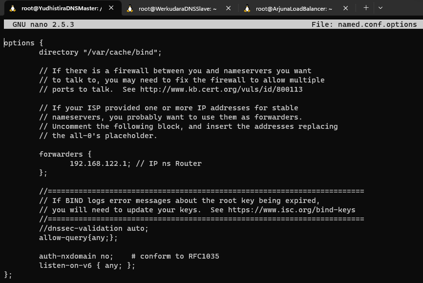

```bind
options {
        directory "/var/cache/bind";

        // If there is a firewall between you and nameservers you want
        // to talk to, you may need to fix the firewall to allow multiple
        // ports to talk.  See http://www.kb.cert.org/vuls/id/800113

        // If your ISP provided one or more IP addresses for stable
        // nameservers, you probably want to use them as forwarders.
        // Uncomment the following block, and insert the addresses replacing
        // the all-0's placeholder.

        forwarders {
               192.168.122.1; // Router NS IP
        };

        //========================================================================
        // If BIND logs error messages about the root key being expired,
        // you will need to update your keys.  See https://www.isc.org/bind-keys
        //========================================================================
        //dnssec-validation auto;
        allow-query{any;};

        auth-nxdomain no;    # conform to RFC1035
        listen-on-v6 { any; };
};
```

Adding `allow-query{any;};` allows the DNS server to accept various types of DNS queries, including queries related to subdomain delegation. Additionally, IP forwarding to the router is enabled so that clients can access the internet using just the Master nameserver.

### Setting DNS Slave

> _named.conf.local_ on Werkudara

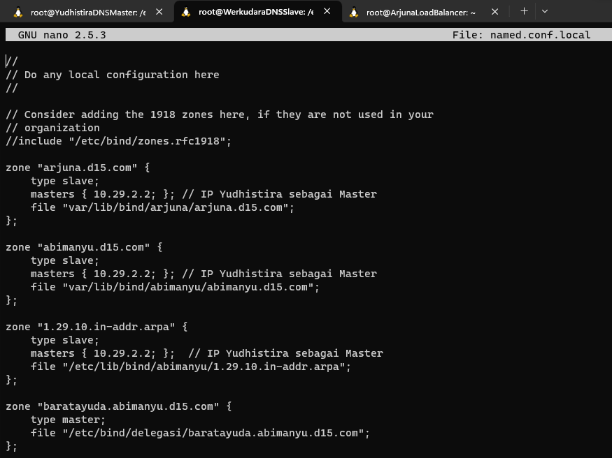

```bind
//
// Do any local configuration here
//

// Consider adding the 1918 zones here, if they are not used in your
// organization
//include "/etc/bind/zones.rfc1918";

zone "arjuna.d15.com" {
    type slave;
    masters { 10.29.2.2; }; // Yudhistira IP as Master
    file "var/lib/bind/arjuna/arjuna.d15.com";
};

zone "abimanyu.d15.com" {
    type slave;
    masters { 10.29.2.2; }; // Yudhistira IP as Master
    file "var/lib/bind/abimanyu/abimanyu.d15.com";
};

zone "1.29.10.in-addr.arpa" {
    type slave;
    masters { 10.29.2.2; };  // Yudhistira IP as Master
    file "/etc/lib/bind/abimanyu/1.29.10.in-addr.arpa";
};

zone "baratayuda.abimanyu.d15.com" {
    type master;
    file "/etc/bind/delegasi/baratayuda.abimanyu.d15.com";
};
```

In this configuration, several zones are configured on the DNS server:

- Zones `"arjuna.d15.com"` and `"abimanyu.d15.com"` are defined as **slave zones** tracking the master server (Yudhistira) to store copies of the master zone data.
- Zone `"1.29.10.in-addr.arpa"` is also a **slave zone** tracking the master server for **reverse DNS resolution**.
- Zone `"baratayuda.abimanyu.d15.com"` is defined as a master zone, meaning this DNS server is authoritative for this zone and responsible for the delegated subdomain `"baratayuda.abimanyu.d15.com"`.

The BIND zone file for the delegated Baratayuda zone is as follows:

> _Delegated Baratayuda Zone_

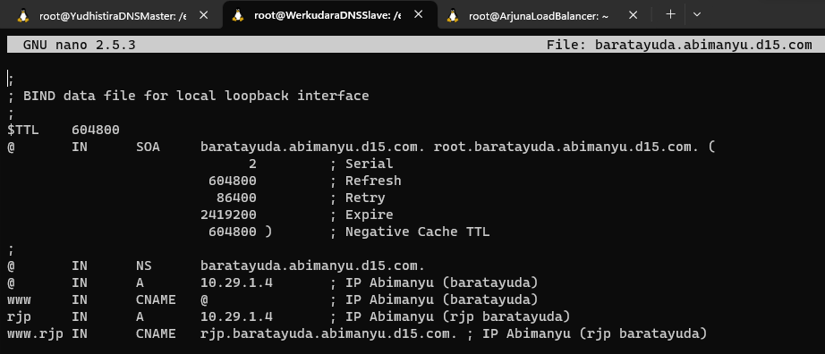

```bind
;
; BIND data file for local loopback interface
;
$TTL    604800
@       IN      SOA     baratayuda.abimanyu.d15.com. root.baratayuda.abimanyu.d15.com. (
                              2         ; Serial
                         604800         ; Refresh
                          86400         ; Retry
                        2419200         ; Expire
                         604800 )       ; Negative Cache TTL
;
@       IN      NS      baratayuda.abimanyu.d15.com.
@       IN      A       10.29.1.4       ; Abimanyu IP (baratayuda)
www     IN      CNAME   @               ; Abimanyu IP (baratayuda)
rjp     IN      A       10.29.1.4       ; Abimanyu IP (rjp baratayuda)
www.rjp IN      CNAME   rjp.baratayuda.abimanyu.d15.com. ; Abimanyu IP (rjp baratayuda)
```

The **NS (Name Server)** declaration connects this zone to the authoritative server `baratayuda.abimanyu.d15.com.` pointing to IP `10.29.1.4`. The **A** record maps IP `10.29.1.4` to domain name `baratayuda.abimanyu.d15.com`. The **CNAME** record creates the `www` alias to refer to `baratayuda.abimanyu.d15.com`, and `rjp` points to IP `10.29.1.4`. Lastly, another **CNAME** record maps `www.rjp` to `rjp.baratayuda.abimanyu.d15.com`.

To make the delegation work properly, adjust `named.conf.options` on Werkudara:

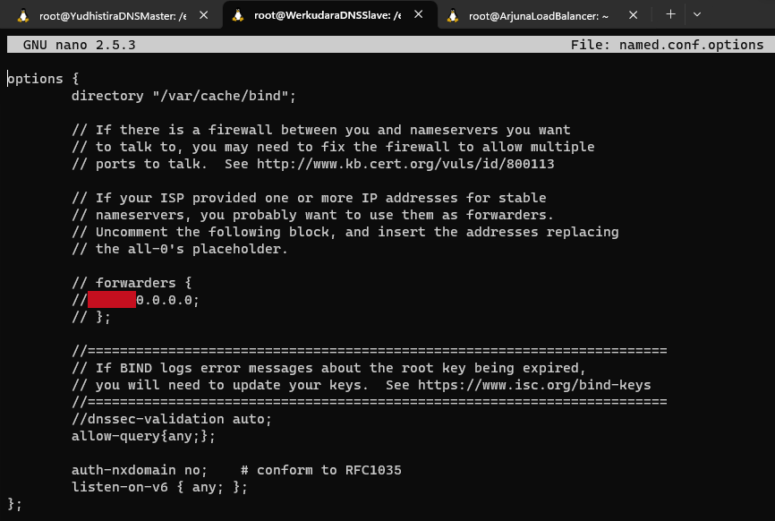

```bind
options {
        directory "/var/cache/bind";

        // If there is a firewall between you and nameservers you want
        // to talk to, you may need to fix the firewall to allow multiple
        // ports to talk.  See http://www.kb.cert.org/vuls/id/800113

        // If your ISP provided one or more IP addresses for stable
        // nameservers, you probably want to use them as forwarders.
        // Uncomment the following block, and insert the addresses replacing
        // the all-0's placeholder.

        // forwarders {
        //      0.0.0.0;
        // };

        //========================================================================
        // If BIND logs error messages about the root key being expired,
        // you will need to update your keys.  See https://www.isc.org/bind-keys
        //========================================================================
        //dnssec-validation auto;
        allow-query{any;};

        auth-nxdomain no;    # conform to RFC1035
        listen-on-v6 { any; };
};
```

This setting is identical to the master, except IP forwarding to the router for internet access is not enabled here.

To ensure everything runs automatically when nodes boot up and progress is preserved:

- Copy the bind folder to root: `cp -rf /etc/bind /root/dns`
- Create an installation and startup script for bind9:

```sh
apt-get update
apt-get install bind9 -y
cp -r -f /root/dns/bind /etc/
service bind9 restart
```

- Call the script via **/root/.bashrc**

Below is the testing result from NakulaClient:

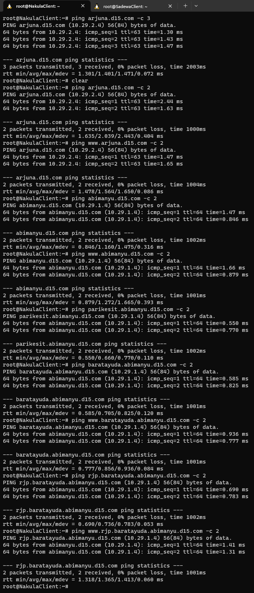

## Web Server Setup (Nginx)

Web servers will be configured on ArjunaLoadBalancer, AbimanyuWebServer, PrabakusumaWebServer, and WisanggeniWebServer. The requirements from the questions are:

- Arjuna is an Nginx Load Balancer with three workers (also running Nginx as web servers): Prabakusuma, Abimanyu, and Wisanggeni. <span style="color:orange; font-weight:bold;">(Question 9)</span>
- Use the Round Robin algorithm for the Load Balancer on Arjuna. Use the server_name from question 1. The web servers on each worker must run on ports 8001-8003. Example: <span style="color:orange; font-weight:bold;">(Question 10)</span>
  - _Prabakusuma:8001_
  - _Abimanyu:8002_
  - _Wisanggeni:8003_

First, configure the Nginx Load Balancer on the Arjuna node, implementing the **Round Robin** load balancing algorithm.

### Setting Load Balancer

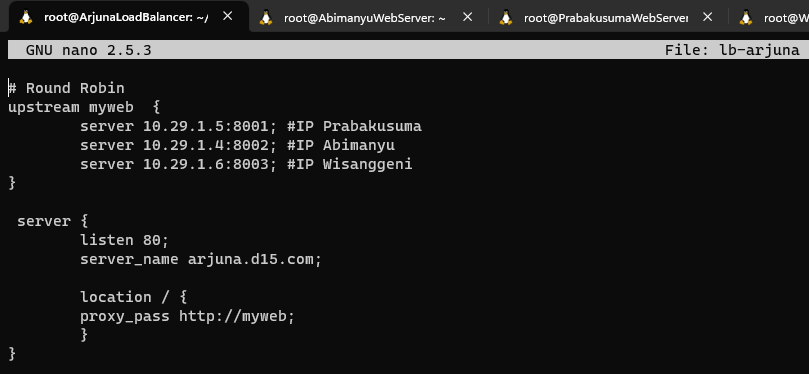

```nginx
# Round Robin
upstream myweb  {
        server 10.29.1.5:8001; # Prabakusuma IP
        server 10.29.1.4:8002; # Abimanyu IP
        server 10.29.1.6:8003; # Wisanggeni IP
}

 server {
        listen 80;
        server_name arjuna.d15.com;

        location / {
        proxy_pass http://myweb;
        }
}
```

- `upstream`: Defines the server group that receives traffic, named `myweb`. In this case, three servers are defined: `10.29.1.5:8001`, `10.29.1.4:8002`, and `10.29.1.6:8003`. With the Round Robin method, traffic is distributed equally among them.
- `listen`: Specifies that the web server listens on port 80.
- `location / { ... }`: Sets up request handling so all requests are proxied to the upstream server group.

After implementing these settings, create the symlink with `ln -s /etc/nginx/sites-available/lb-arjuna /etc/nginx/sites-enabled` and restart Nginx with `service nginx restart`.

### Setting Worker

After configuring the load balancer, we configure Nginx on each worker node.

#### Abimanyu

On the Abimanyu server, create a file in `sites-available` named `arjuna` with the following configuration:

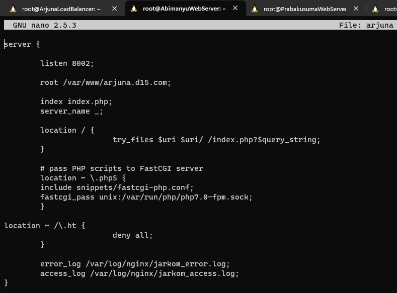

```nginx
server {

        listen 8002;

        root /var/www/arjuna.d15.com;

        index index.php;
        server_name _;

        location / {
                        try_files $uri $uri/ /index.php?$query_string;
        }

        # pass PHP scripts to FastCGI server
        location ~ \.php$ {
        include snippets/fastcgi-php.conf;
        fastcgi_pass unix:/var/run/php/php7.0-fpm.sock;
        }

location ~ /\.ht {
                        deny all;
        }

        error_log /var/log/nginx/jarkom_error.log;
        access_log /var/log/nginx/jarkom_access.log;
}
```

In this configuration, the Nginx server runs on port `8002`:

- Points to root directory at `/var/www/arjuna.d15.com`.
- Uses `index.php` as the index file.
- Uses placeholder `server_name _;` to handle all incoming requests.
- Uses `location /` to handle routing, trying to find matching files or directing to index.php with the query string.
- Uses `location ~ \.php$` to forward PHP requests to the FastCGI server.
- Denies access to `.htaccess` files using `location ~ /\.ht`.
- Logs errors to `/var/log/nginx/jarkom_error.log`.
- Logs access requests to `/var/log/nginx/jarkom_access.log`.

Create a symlink with `ln -s /etc/nginx/sites-available/arjuna /etc/nginx/sites-enabled` and restart Nginx with `service nginx restart`. Because Abimanyu will also run Apache2 for the Abimanyu web site, remove the default Nginx site config from sites-enabled to avoid port conflicts on port 80: `rm -rf /etc/nginx/sites-enabled/default`.

Next, download the `index.php` file provided in the problem description:

- Download file using wget:

```bash
wget --load-cookies /tmp/cookies.txt "https://docs.google.com/uc?export=download&confirm=$(wget --quiet --save-cookies /tmp/cookies.txt --keep-session-cookies --no-check-certificate 'https://docs.google.com/uc?export=download&id=17tAM_XDKYWDvF-JJix1x7txvTBEax7vX' -O- | sed -rn 's/.*confirm=([0-9A-Za-z_]+).*/\1\n/p')&id=17tAM_XDKYWDvF-JJix1x7txvTBEax7vX" -O arjuna.zip && rm -rf /tmp/cookies.txt
```

- Unzip file with output folder name `arjuna.d15.com`.

#### Prabakusuma and Wisanggeni

The Nginx configuration on Prabakusuma and Wisanggeni is identical to Abimanyu, except removing the default site from sites-enabled is not required because they do not run Apache2.

> Nginx configuration on Prabakusuma

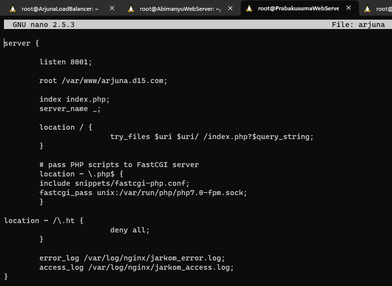

```nginx
server {

        listen 8001;

        root /var/www/arjuna.d15.com;

        index index.php;
        server_name _;

        location / {
                        try_files $uri $uri/ /index.php?$query_string;
        }

        # pass PHP scripts to FastCGI server
        location ~ \.php$ {
        include snippets/fastcgi-php.conf;
        fastcgi_pass unix:/var/run/php/php7.0-fpm.sock;
        }

location ~ /\.ht {
                        deny all;
        }

        error_log /var/log/nginx/jarkom_error.log;
        access_log /var/log/nginx/jarkom_access.log;
}
```

> Nginx configuration on Wisanggeni

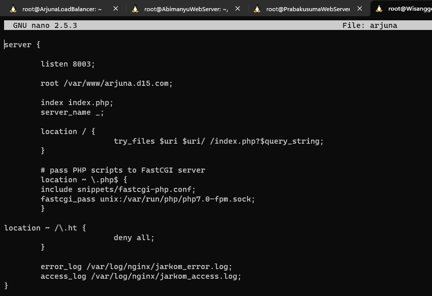

```nginx
server {

        listen 8003;

        root /var/www/arjuna.d15.com;

        index index.php;
        server_name _;

        location / {
                        try_files $uri $uri/ /index.php?$query_string;
        }

        # pass PHP scripts to FastCGI server
        location ~ \.php$ {
        include snippets/fastcgi-php.conf;
        fastcgi_pass unix:/var/run/php/php7.0-fpm.sock;
        }

location ~ /\.ht {
                        deny all;
        }

        error_log /var/log/nginx/jarkom_error.log;
        access_log /var/log/nginx/jarkom_access.log;
}
```

Below is the testing result with `lynx arjuna.d15.com`:

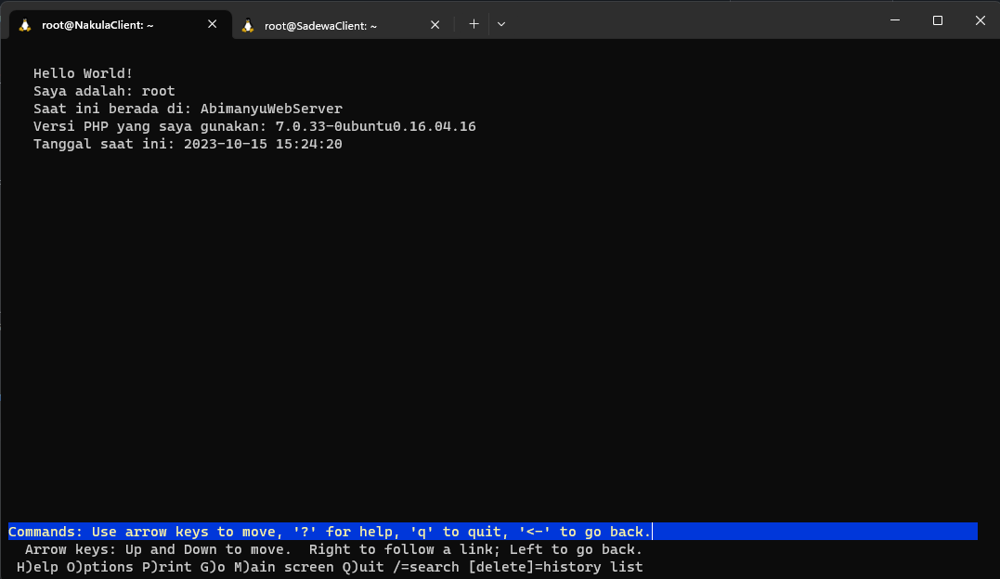

When repeating requests in Lynx, the responding worker server alternates. To verify each worker individually, stop Nginx on all worker servers except the target worker to be tested.

## Web Server Configuration (Apache)

Web servers will be configured on AbimanyuWebServer. Requirements from the questions are:

- In addition to Nginx, configure the Apache Web Server on worker Abimanyu with web server www.abimanyu.yyy.com. DocumentRoot is at /var/www/abimanyu.yyy <span style="color:orange; font-weight:bold;">(Question 11)</span>
- Then rewrite the URL www.abimanyu.yyy.com/index.php/home to www.abimanyu.yyy.com/home <span style="color:orange; font-weight:bold;">(Question 12)</span>
- Additionally, on subdomain www.parikesit.abimanyu.yyy.com, DocumentRoot is stored at /var/www/parikesit.abimanyu.yyy <span style="color:orange; font-weight:bold;">(Question 13)</span>
- On this subdomain, folder /public can only perform directory listing, whereas /secret cannot be accessed (403 Forbidden) <span style="color:orange; font-weight:bold;">(Question 14)</span>
- Customize error pages in /error to override Apache error codes (404 Not Found and 403 Forbidden) <span style="color:orange; font-weight:bold;">(Question 15)</span>
- Create a virtual host configuration so asset file www.parikesit.abimanyu.yyy.com/public/js becomes www.parikesit.abimanyu.yyy.com/js <span style="color:orange; font-weight:bold;">(Question 16)</span>
- For security, configure www.rjp.baratayuda.abimanyu.yyy.com to only be accessible via ports 14000 and 14400 <span style="color:orange; font-weight:bold;">(Question 17)</span>
- Set up authentication with username “Wayang” and password “baratayudayyy” with yyy as the group code. DocumentRoot at /var/www/rjp.baratayuda.abimanyu.yyy <span style="color:orange; font-weight:bold;">(Question 18)</span>
- Redirect any direct access to Abimanyu's IP to www.abimanyu.yyy.com (alias) <span style="color:orange; font-weight:bold;">(Question 19)</span>
- Rewrite image requests on www.parikesit.abimanyu.yyy.com containing the substring “abimanyu” to point to abimanyu.png <span style="color:orange; font-weight:bold;">(Question 20)</span>

> _Installing Apache2 and PHP_

Install Apache2 on Abimanyu web server:

```
$ apt-get update && apt-get install apache2 -y
```

Also install PHP:

```
$ apt-get install php libapache2-mod-php7.0 -y
```

Next, configure the web server for each FQDN as follows:

> _abimanyu.d15.com_

Create the file `/etc/apache2/sites-available/abimanyu.d15.conf` with:

```apache
<VirtualHost *:80>

   ServerName abimanyu.d15.com
   ServerAlias www.abimanyu.d15.com
   ServerAdmin webmaster@localhost
   DocumentRoot /var/www/abimanyu.d15

</VirtualHost>
```

Then enable the site:

```
$ a2ensite /etc/apache2/sites-available/abimanyu.d15.conf
```

Next, rewrite `www.abimanyu.yyy.com/index.php/home` to `www.abimanyu.yyy.com/home`.

Add the following to `/etc/apache2/sites-available/abimanyu.d15.conf`:

```apache
<Directory /var/www/abimanyu.d15>
   Options +FollowSymLinks -Multiviews
   AllowOverride All
</Directory>
```

Also add the following to `/var/www/abimanyu.d15/.htaccess`:

```apache
RewriteEngine On
RewriteCond ${REQUEST_FILENAME} !-d
RewriteRule ^([^\.]+)$ $1.html [NC,L]
```

This rewrite rule removes `*.html` from requests so we can request `http://abimanyu.d15.com/home` since the index page is located at `/var/www/abimanyu.d15/home.html`.

Enable the rewrite module:

```
$ a2enmod rewrite
```

To automatically redirect direct IP access on Abimanyu to `www.abimanyu.yyy.com`, add the following in `000-default.conf`:

```apache
<VirtualHost *:80>

   ServerName 10.29.1.4
   Redirect permanent / http://www.abimanyu.d15.com/
   ServerAdmin webmaster@localhost
   DocumentRoot /var/www/abimanyu.d15.com

</VirtualHost>
```

Restart Apache2:

```
$ service apache2 restart
```

> _parikesit.abimanyu.d15.com_

Create `/etc/apache2/sites-available/parikesit.abimanyu.d15.conf` with:

```apache
<VirtualHost *:80>

   ServerName parikesit.abimanyu.d15.com
   ServerAlias www.parikesit.abimanyu.d15.com
   ServerAdmin webmaster@localhost
   DocumentRoot /var/www/parikesit.abimanyu.d15

</VirtualHost>
```

Enable the site:

```
$ a2ensite /etc/apache2/sites-available/parikesit.abimanyu.d15.conf
```

Next, configure `/public` to allow directory listing and `/secret` to be forbidden (403 Forbidden) by adding the following to `/etc/apache2/sites-available/parikesit.abimanyu.d15.conf`:

```apache
<Directory /var/www/parikesit.abimanyu.d15/public>
        Options +Indexes
</Directory>

<Directory /var/www/parikesit.abimanyu.d15/secret>
        Options -Indexes
</Directory>
```

To customize error pages in `/error` for error codes 404 Not Found and 403 Forbidden, add the following to `/etc/apache2/sites-available/parikesit.abimanyu.d15.conf`:

```apache
ErrorDocument 404 /error/404.html
ErrorDocument 403 /error/403.html
```

To alias asset files from `www.parikesit.abimanyu.yyy.com/public/js` to `www.parikesit.abimanyu.yyy.com/js`:

```apache
Alias "/js" "/var/www/parikesit.abimanyu.d15.com/public/js"
```

To rewrite image requests containing substring “abimanyu” to `abimanyu.png`:

```apache
RewriteEngine On
RewriteCond ${REQUEST_URI} abimanyu
RewriteRule \.(jpg|jpeg|png|gif)$ /public/images/abimanyu.png [L]
```

Enable rewrite module:

```
$ a2enmod rewrite
```

Restart Apache2:

```
$ service apache2 restart
```

> _rjp.baratayuda.abimanyu.d15.com_

To restrict `www.rjp.baratayuda.abimanyu.yyy.com` to only ports 14000 and 14400, configure `/etc/apache2/sites-available/rjp.baratayuda.abimanyu.d15.com`:

```apache
<VirtualHost *:14000 *:14400>

   ServerName rjp.baratayuda.abimanyu.d15.com
   ServerAlias www.rjp.baratayuda.abimanyu.d15.com
   ServerAdmin webmaster@localhost
   DocumentRoot /var/www/rjp.baratayuda.abimanyu.d15

   <Directory /var/www/rjp.baratayuda.abimanyu.d15.com>
        AuthType Basic
        AuthName "Restricted Area"
        AuthUserFile /etc/apache2/.htpasswd
        Require valid-user
   </Directory>

</VirtualHost>
```

Enable the site:

```
$ a2ensite /etc/apache2/sites-available/rjp.baratayuda.abimanyu.d15.conf
```

Create `/etc/apache2/.htpasswd` with username and password:

```
$ htpasswd -bc /etc/apache2/.htpasswd Wayang baratayudad15
```

Enable required authentication modules:

```
$ a2enmod authn_core authz_core authn_file authz_user
```

Restart Apache2:

```
$ service apache2 restart
```

> _Testing_

To verify, install lynx on NakulaClient:

```
$ apt-get update && apt-get install lynx -y
```

11. www.abimanyu.d15.com

```
$ lynx www.abimanyu.d15.com
```

Result:
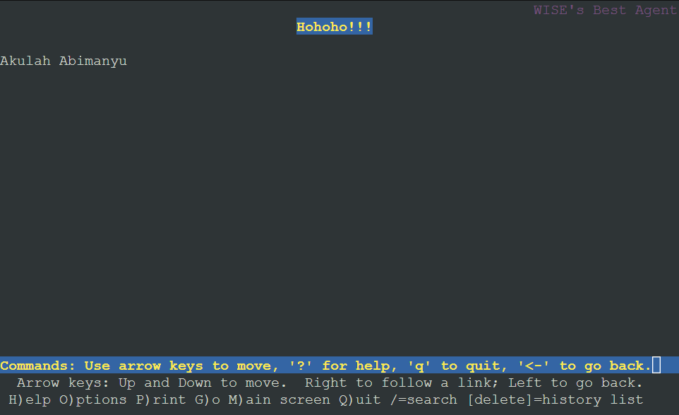

12. www.abimanyu.yyy.com/home

```
$ lynx www.abimanyu.d15.com/home
```

Result:


13. www.parikesit.abimanyu.yyy.com

```
$ lynx www.parikesit.abimanyu.yyy.com
```

Result:
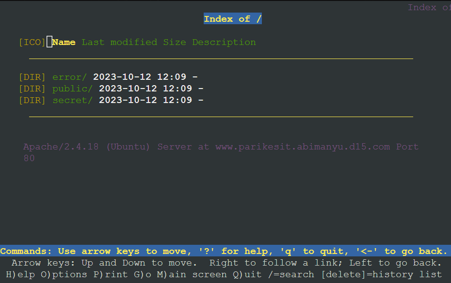

14. /public allows directory listing, while /secret is inaccessible (403 Forbidden)

```
$ lynx parikesit.abimanyu.d15.com/secret
```

Result:
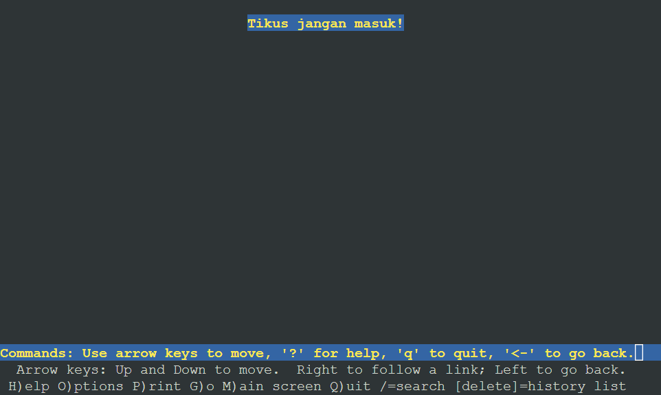

15. Custom error pages in /error replacing error codes 404 Not Found and 403 Forbidden:

```
$ lynx parikesit.abimanyu.d15.com/secret
```

Result:


```
$ lynx parikesit.abimanyu.d15.com/testing
```

Result:
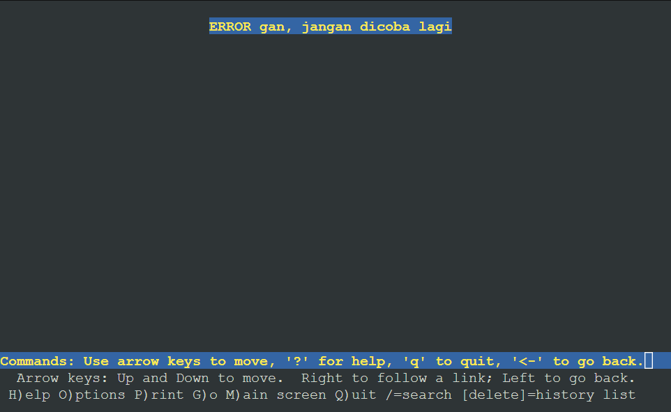

16. www.parikesit.abimanyu.yyy.com/public/js becomes www.parikesit.abimanyu.yyy.com/js

```
$ lynx parikesit.abimanyu.d15.com/js
```

Result:
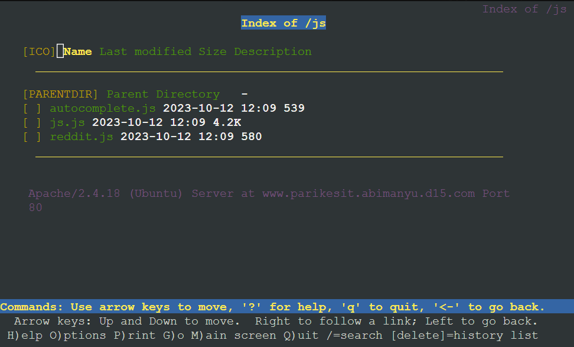

17. www.rjp.baratayuda.abimanyu.yyy.com only accessible via ports 14000 and 14400:

```
$ lynx rjp.baratayuda.abimanyu.d15.com:14000
```

or

```
$ lynx rjp.baratayuda.abimanyu.d15.com:14400
```

Result:


```
$ lynx rjp.baratayuda.abimanyu.d15.com:8900
```

Result:
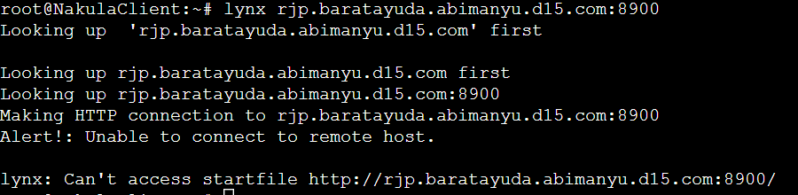

18. Authentication with username “Wayang” and password “baratayudayyy” (where yyy is group code):

```
$ lynx rjp.baratayuda.abimanyu.d15.com:14000
```

or

```
$ lynx rjp.baratayuda.abimanyu.d15.com:14400
```

Result:
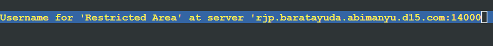

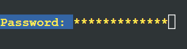

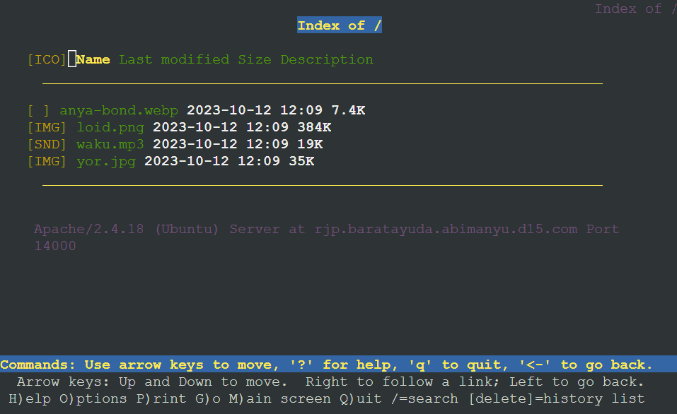

19. Every access to Abimanyu's IP automatically redirects to www.abimanyu.yyy.com:

```
$ lynx 10.29.1.4
```

Result:


20. Rewrite image requests with substring “abimanyu” to point to abimanyu.png:

To verify the downloaded image is `abimanyu.png`, install exiftool on NakulaClient:

```
$ apt-get install exiftool -y
```

Download image:

```
$ lynx parikesit.abimanyu.d15.com/public/images/abimanyu.png
```

Check file metadata:

```
$ exiftool abimanyu.png
```

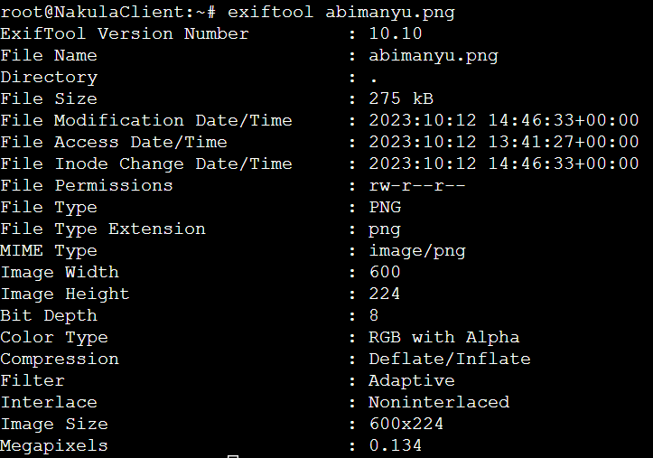

Download another file containing the substring "abimanyu":

```
$ lynx parikesit.abimanyu.d15.com/public/images/not-abimanyu.png
```

Check file metadata:

```
$ exiftool abimanyu.png
```

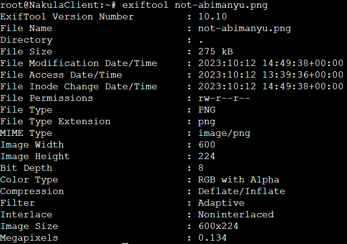

As seen above, despite the different request names, the metadata is identical, confirming that `abimanyu.png` was downloaded.

## Bash Scripts
Here are the startup/restore scripts run by each node to restore configurations upon boot. Core directories such as `/etc/bind`, `/etc/nginx`, `/etc/apache2`, `/var/www` are backed up to root to persist across GNS3 restarts. All of these scripts are invoked in `/root/.bashrc`.

> _Yudhistira Script_

```bash
echo nameserver 192.168.122.1 > /etc/resolv.conf

apt-get update
apt-get install bind9 -y
cp -r -f /root/dns/bind /etc/
service bind9 restart
```

> _Werkudara Script_

```bash
echo nameserver 192.168.122.1 > /etc/resolv.conf

apt-get update
apt-get install bind9 -y
cp -r -f /root/dns/bind /etc/
service bind9 restart
```

> _Arjuna Script_

```bash
echo nameserver 192.168.122.1 > /etc/resolv.conf

apt-get update
apt-get install nginx -y
service nginx start
cp -r -f /root/arjunalb/nginx /etc
service nginx restart
```

> _Abimanyu Script_

```bash
echo nameserver 192.168.122.1 > /etc/resolv.conf

cp -rf ~/webserver/www /var

apt-get update && apt-get install nginx php php-fpm apache2 libapache2-mod-php7.0 -y
service nginx start
cp -r -f /root/webserver/nginx /etc
service php7.0-fpm start
service php7.0-fpm restart
rm -rf /etc/nginx/sites-enabled/default
service nginx restart

cp -rf ~/webserver/apache2 /etc
a2ensite abimanyu.d15.conf
a2ensite parikesit.d15.conf
a2ensite rjp.baratayuda.abimanyu.d15.conf

htpasswd -bc /etc/apache2/.htpasswd Wayang baratayudad15

a2enmod authn_core authz_core authn_file authz_user rewrite

service apache2 restart
```

> _Prabakusuma Script_

```bash
echo nameserver 192.168.122.1 > /etc/resolv.conf

apt-get update && apt install nginx php php-fpm -y
service nginx start
cp -r -f /root/webserver/nginx /etc
cp -r -f /root/webserver/www /var
service php7.0-fpm start
service php7.0-fpm restart
rm -rf /etc/nginx/sites-enabled/default
service nginx restart
```

> _Wisanggeni Script_

```bash
echo nameserver 192.168.122.1 > /etc/resolv.conf

apt-get update && apt install nginx php php-fpm -y
service nginx start
cp -r -f /root/webserver/nginx /etc
cp -r -f /root/webserver/www /var
service php7.0-fpm start
service php7.0-fpm restart
rm -rf /etc/nginx/sites-enabled/default
service nginx restart
```

> _Nakula Script_

```bash
echo 'nameserver 10.29.2.2
nameserver 10.29.2.3 ' > /etc/resolv.conf

apt-get update -y
apt-get install dnsutils -y
apt-get install lynx -y
```

> _Sadewa Script_

```bash
echo 'nameserver 10.29.2.2
nameserver 10.29.2.3 ' > /etc/resolv.conf

apt-get update -y
apt-get install dnsutils -y
apt-get install lynx -y
```