# **DHCP Relay, High-Performance Load Balancing, and PHP-FPM Worker Tuning - Group D15**

## Table of Contents

- [Prerequisites](#prerequisites)
    - [Topology Setup](#topology-setup)
    - [Network Configuration](#network-configuration)
- [Question 0](#question-0)
- [DHCP Setup](#dhcp-setup)
- [PHP Worker](#php-worker)
    - [Question 6](#question-6)
    - [Question 7](#question-7)
    - [Question 8](#question-8)
    - [Question 9](#question-9)
    - [Question 10](#question-10)
    - [Question 11](#question-11)
    - [Question 12](#question-12)
- [Database Configuration](#database-configuration)
    - [Question 13](#question-13)
- [Laravel Worker](#laravel-worker)
    - [Question 14](#question-14)
    - [Question 15](#question-15)
    - [Question 16](#question-16)
    - [Question 17](#question-17)
    - [Question 18](#question-18)
    - [Question 19](#question-19)
    - [Question 20](#question-20)

## Prerequisites

There are several prerequisites to prepare before proceeding with the lab tasks: topology setup and network configurations. _**(Question 1)**_

### Topology Setup

The topology is configured according to the practicum specifications, as shown in the diagram and table below:

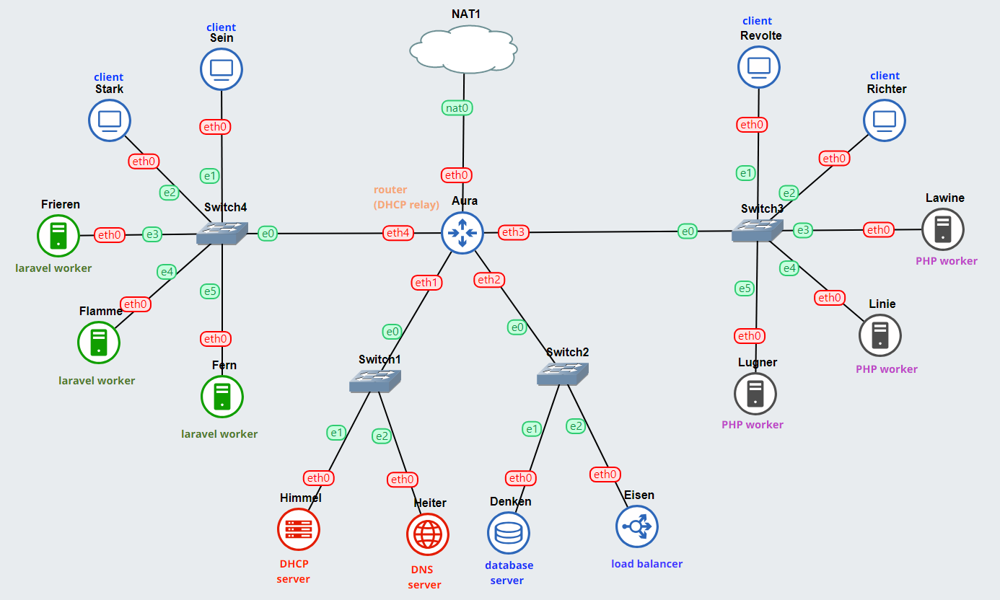

| Node               | Category         | Docker Image                        | IP Configuration | 
|--------------------|------------------|-------------------------------------|------------------| 
| Aura               | Router (DHCP Relay)| danielcristh0/debian-buster:1.1   | Dynamic          | 
| Himmel             | DHCP Server      | danielcristh0/debian-buster:1.1   | Static           | 
| Heiter             | DNS Server       | danielcristh0/debian-buster:1.1   | Static           | 
| Denken             | Database Server  | danielcristh0/debian-buster:1.1   | Static           | 
| Eisen              | Load Balancer    | danielcristh0/debian-buster:1.1   | Static           | 
| Frieren            | Laravel Worker   | danielcristh0/debian-buster:1.1   | Static           | 
| Flamme             | Laravel Worker   | danielcristh0/debian-buster:1.1   | Static           | 
| Fern               | Laravel Worker   | danielcristh0/debian-buster:1.1   | Static           | 
| Lawine             | PHP Worker       | danielcristh0/debian-buster:1.1   | Static           | 
| Linie              | PHP Worker       | danielcristh0/debian-buster:1.1   | Static           | 
| Lugner             | PHP Worker       | danielcristh0/debian-buster:1.1   | Static           | 
| Revolte            | Client           | danielcristh0/debian-buster:1.1   | Dynamic          | 
| Richter            | Client           | danielcristh0/debian-buster:1.1   | Dynamic          | 
| Sein               | Client           | danielcristh0/debian-buster:1.1   | Dynamic          | 
| Stark              | Client           | danielcristh0/debian-buster:1.1   | Dynamic          | 

### Network Configuration

Based on the requirements, here is the list of IP addresses and network configurations for each node:

#### IPs

```
Aura: Dynamic DHCP
Himmel: 10.29.1.1
Heiter: 10.29.1.2
Denken: 10.29.2.1
Eisen: 10.29.2.2
Frieren: 10.29.4.1
Flamme: 10.29.4.2
Fern: 10.29.4.3
Lawine: 10.29.3.1
Linie: 10.29.3.2
Lugner: 10.29.3.3
Revolte: Dynamic DHCP
Richter: Dynamic DHCP
Sein: Dynamic DHCP
Stark: Dynamic DHCP
```

#### Aura (Router/DHCP Relay)

```
auto eth0
iface eth0 inet dhcp

auto eth1
iface eth1 inet static
	address 10.29.1.254
	netmask 255.255.255.0

auto eth2
iface eth2 inet static
	address 10.29.2.254
	netmask 255.255.255.0

auto eth3
iface eth3 inet static
	address 10.29.3.254
	netmask 255.255.255.0

auto eth4
iface eth4 inet static
	address 10.29.4.254
	netmask 255.255.255.0
```

#### Himmel (DHCP Server)

```
auto eth0
iface eth0 inet static	
address 10.29.1.1
netmask 255.255.255.0
gateway 10.29.1.254
```

#### Heiter (DNS Server)

```
auto eth0
iface eth0 inet static	
address 10.29.1.2
netmask 255.255.255.0
gateway 10.29.1.254
```

#### Denken (Database Server)

```
auto eth0
iface eth0 inet dhcp
hwaddress ether d2:5b:49:77:c6:53
```

#### Eisen (Load Balancer)

```
auto eth0
iface eth0 inet dhcp
hwaddress ether 2e:14:fa:49:d4:26
```

#### Frieren (Laravel Worker)

```
auto eth0
iface eth0 inet dhcp
hwaddress ether 62:85:dc:12:6a:e1
```

#### Flamme (Laravel Worker)

```
auto eth0
iface eth0 inet dhcp
hwaddress ether 0a:c9:e8:93:9a:99
```

#### Fern (Laravel Worker)

```
auto eth0
iface eth0 inet dhcp
hwaddress ether 56:68:5d:5c:05:38
```

#### Lawine (PHP Worker)

```
auto eth0
iface eth0 inet dhcp
hwaddress ether 26:5f:26:7d:8f:93
```

#### Linie (PHP Worker)

```
auto eth0
iface eth0 inet dhcp
hwaddress ether a2:22:e8:fa:6f:3d
```

#### Lugner (PHP Worker)

```
auto eth0
iface eth0 inet dhcp
hwaddress ether 26:88:d2:3f:d6:34
```

#### Revolte (Client)

```
auto eth0
iface eth0 inet dhcp
```

#### Richter (Client)

```
auto eth0
iface eth0 inet dhcp
```

#### Sein (Client)

```
auto eth0
iface eth0 inet dhcp
```

#### Stark (Client)

```
auto eth0
iface eth0 inet dhcp
```

## Question 0
After defeating the Demon King, the journey continues. This time, you are tasked with registering domains: **riegel.canyon.yyy.com** for the Laravel worker and **granz.channel.yyy.com** for the PHP worker (0), pointing to the worker with the IP address `[IP prefix].x.1`.

First, install bind9 before configuring it as requested:

```sh
apt-get update
apt-get install bind9 -y
```

Next, configure Bind9 as required, from `named.conf.local` and `named.conf.options` to the BIND zone files for each zone.

_named.conf.local_

```bind
//
// Do any local configuration here
//

// Consider adding the 1918 zones here, if they are not used in your
// organization
//include "/etc/bind/zones.rfc1918";

zone "riegel.canyon.d15.com" {
        type master;
        file "/etc/bind/jarkom/riegel.canyon.d15.com";
};

zone "granz.channel.d15.com" {
        type master;
        file "/etc/bind/jarkom/granz.channel.d15.com";
};
```

In this file, two zones are declared for each domain.

_named.conf.options_

```bind
options {
        directory "/var/cache/bind";

        // If there is a firewall between you and nameservers you want
        // to talk to, you may need to fix the firewall to allow multiple
        // ports to talk.  See http://www.kb.cert.org/vuls/id/800113

        // If your ISP provided one or more IP addresses for stable
        // nameservers, you probably want to use them as forwarders.
        // Uncomment the following block, and insert the addresses replacing
        // the all-0's placeholder.

        forwarders {
                192.168.122.1;
        };

        //========================================================================
        // If BIND logs error messages about the root key being expired,
        // you will need to update your keys.  See https://www.isc.org/bind-keys
        //========================================================================
        //dnssec-validation auto;

        allow-query{any;};
        listen-on-v6 { any; };
};
```

Here, we forward nameserver queries to the router so that clients and servers connected to the DNS server have internet access.

**/etc/bind/jarkom/riegel.canyon.d15.com**

```bind
;
; BIND data file for local loopback interface
;
$TTL    604800
@       IN      SOA     riegel.canyon.d15.com. root.riegel.canyon.d15.com. (
                              2         ; Serial
                         604800         ; Refresh
                          86400         ; Retry
                        2419200         ; Expire
                         604800 )       ; Negative Cache TTL
;
@       IN      NS      riegel.canyon.d15.com.
@       IN      A       10.29.4.1       ; Frieren IP
www     IN      CNAME   riegel.canyon.d15.com.
```

**/etc/bind/jarkom/granz.channel.d15.com**

```bind
;
; BIND data file for local loopback interface
;
$TTL    604800
@       IN      SOA     granz.channel.d15.com. root.granz.channel.d15.com. (
                              2         ; Serial
                         604800         ; Refresh
                          86400         ; Retry
                        2419200         ; Expire
                         604800 )       ; Negative Cache TTL
;
@       IN      NS      granz.channel.d15.com.
@       IN      A       10.29.3.1       ; Lawine IP
www     IN      CNAME   granz.channel.d15.com.
```

After configuring each zone pointing to the respective worker IP, verify the results on the client using **ping** and **nslookup**.

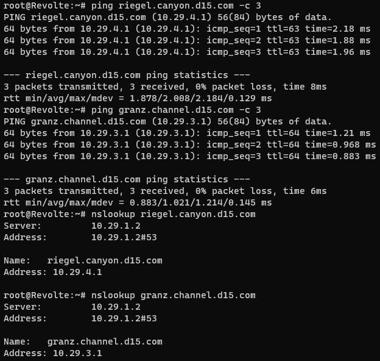

## DHCP Setup
The DHCP setup covers Questions 2 through 5:
- All **CLIENTS** must use configuration obtained from the DHCP Server.
- Clients connected via Switch3 receive IP addresses from ranges `[IP prefix].3.16` - `[IP prefix].3.32` and `[IP prefix].3.64` - `[IP prefix].3.80` **(Question 2)**
- Clients connected via Switch4 receive IP addresses from ranges `[IP prefix].4.12` - `[IP prefix].4.20` and `[IP prefix].4.160` - `[IP prefix].4.168` **(Question 3)**
- Clients obtain DNS configuration from Heiter and can connect to the internet through that DNS **(Question 4)**
- DHCP lease times: Clients via Switch3 lease for 3 minutes, while clients via Switch4 lease for 12 minutes. The maximum lease time allocated is 96 minutes **(Question 5)**

To fulfill these requirements, install `isc-dhcp-server` on Himmel and `isc-dhcp-relay` on Aura.

**Installation on Aura**

```sh
apt-get update
apt-get install isc-dhcp-relay -y
```

**Installation on Himmel**

```sh
apt-get update
apt-get install isc-dhcp-server -y
```

Next, configure **Himmel**:

**/etc/dhcp/dhcpd.conf**

```dhcpd
subnet 10.29.1.0 netmask 255.255.255.0 {
}

subnet 10.29.2.0 netmask 255.255.255.0 {
    option routers 10.29.2.254;
    option broadcast-address 10.29.2.255;
    option domain-name-servers 10.29.1.2;
    default-lease-time 7200;
    max-lease-time 7200;
}

# Client Switch 3
subnet 10.29.3.0 netmask 255.255.255.0 {
    range 10.29.3.16 10.29.3.32;
    range 10.29.3.64 10.29.3.80;
    option routers 10.29.3.254;
    option broadcast-address 10.29.3.255;
    option domain-name-servers 10.29.1.2;
    default-lease-time 180;
    max-lease-time 5760;
}

# Client Switch 4
subnet 10.29.4.0 netmask 255.255.255.0 {
    range 10.29.4.12 10.29.4.20;
    range 10.29.4.160 10.29.4.168;
    option routers 10.29.4.254;
    option broadcast-address 10.29.4.255;
    option domain-name-servers 10.29.1.2;
    default-lease-time 720;
    max-lease-time 5760;
}

# Database Server
host Denken {
    hardware ethernet d2:5b:49:77:c6:53;
    fixed-address 10.29.2.1;
}

# Load Balancer
host Eisen {
    hardware ethernet 2e:14:fa:49:d4:26;
    fixed-address 10.29.2.2;
}

# Laravel Workers
host Frieren {
    hardware ethernet 62:85:dc:12:6a:e1;
    fixed-address 10.29.4.1;
}

host Flamme {
    hardware ethernet 0a:c9:e8:93:9a:99;
    fixed-address 10.29.4.2;
}

host Fern {
    hardware ethernet 56:68:5d:5c:05:38;
    fixed-address 10.29.4.3;
}

# PHP Workers
host Lawine {
    hardware ethernet 26:5f:26:7d:8f:93;
    fixed-address 10.29.3.1;
}

host Linie {
    hardware ethernet a2:22:e8:fa:6f:3d;
    fixed-address 10.29.3.2;
}

host Lugner {
    hardware ethernet 26:88:d2:3f:d6:34;
    fixed-address 10.29.3.3;
}
```

**/etc/default/isc-dhcp-server**

```sh
# Defaults for isc-dhcp-server (sourced by /etc/init.d/isc-dhcp-server)

# Path to dhcpd's config file (default: /etc/dhcp/dhcpd.conf).
#DHCPDv4_CONF=/etc/dhcp/dhcpd.conf
#DHCPDv6_CONF=/etc/dhcp/dhcpd6.conf

# Path to dhcpd's PID file (default: /var/run/dhcpd.pid).
#DHCPDv4_PID=/var/run/dhcpd.pid
#DHCPDv6_PID=/var/run/dhcpd6.pid

# Additional options to start dhcpd with.
#       Don't use options -cf or -pf here; use DHCPD_CONF/ DHCPD_PID instead
#OPTIONS=""

# On what interfaces should the DHCP server (dhcpd) serve DHCP requests?
#       Separate multiple interfaces with spaces, e.g. "eth0 eth1".
INTERFACESv4="eth0"
INTERFACESv6=""
```

Next, configure **Aura**:

**/etc/default/isc-dhcp-relay**

```sh
# Defaults for isc-dhcp-relay initscript
# sourced by /etc/init.d/isc-dhcp-relay
# installed at /etc/default/isc-dhcp-relay by the maintainer scripts

#
# This is a POSIX shell fragment
#

# What servers should the DHCP relay forward requests to?
SERVERS="10.29.1.1"

# On what interfaces should the DHCP relay (dhrelay) serve DHCP requests?
INTERFACES="eth1 eth2 eth3 eth4"

# Additional options that are passed to the DHCP relay daemon?
OPTIONS=""
```

And uncomment `net.ipv4.ip_forward=1` in **/etc/sysctl.conf**.

Restart the DHCP services on each node after applying configuration using `service isc-dhcp-(relay/server) restart`.

Below is the verification result from the client side:

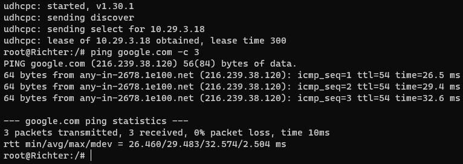

## PHP Worker

All configurations and benchmarks on the PHP Workers fulfill Questions 6 through 12. As preparation, install Nginx, PHP 7.3, PHP 7.3-FPM, htop, wget, and zip/unzip on each worker:

```sh
apt-get update -y
apt-get install nginx php7.3 php7.3-fpm htop wget unzip -y
```

### Question 6
On each PHP worker, configure a virtual host for <a href="https://drive.google.com/file/d/1ViSkRq7SmwZgdK64eRbr5Fm1EGCTPrU1/view?usp=sharing">this website</a> using PHP 7.3.

Requirements include downloading and extracting the website source code, and configuring Nginx so clients can access it.

Download and unzip the website source code into `/var/www`:

```sh
wget --no-check-certificate 'https://drive.usercontent.google.com/download?id=1ViSkRq7SmwZgdK64eRbr5Fm1EGCTPrU1&export=download&authuser=0&confirm=t&uuid=0e499712-8150-42d4-a474-b29dfb026ab6&at=APZUnTVBse4ducwDDntmAkLSWB1_:1699949521984' -O  granz.channel.d15.com
unzip granz.channel.d15.com
```

Configure Nginx on each worker in **/etc/nginx/sites-available/default**:

```nginx
server {
        listen 80 default_server;
        listen [::]:80 default_server;

        root /var/www/html;

        index index.php index.html index.htm;

        server_name _;

        location / {
                try_files $uri $uri/ =404;
        }

        location ~ \.php$ {
                include snippets/fastcgi-php.conf;
                fastcgi_pass unix:/run/php/php7.3-fpm.sock;
        }
}
```

Start PHP 7.3-FPM and Nginx on each worker:

```sh
service php7.3-fpm start
service nginx start
```

Next, configure the load balancer on Eisen.

To configure Eisen as a load balancer and benchmarking node, install Nginx, PHP 7.3, PHP 7.3-FPM, htop, and apache2-utils:

```sh
apt-get update -y
apt-get install nginx php7.3 php7.3-fpm htop apache2-utils -y
```

Configure the load balancer for **granz.channel.d15.com**:

```nginx
upstream backend  {
    hash $request_uri consistent;
    server 10.29.3.1; # Lawine IP
    server 10.29.3.2; # Linie IP
    server 10.29.3.3; # Lugner IP
}

server {
        listen 80;
        server_name granz.channel.d15.com;

        location / {
                proxy_pass http://backend;
                proxy_set_header    X-Real-IP $remote_addr;
                proxy_set_header    X-Forwarded-For $proxy_add_x_forwarded_for;
                proxy_set_header    Host $http_host;
        }

        location ~ /\.ht {
                deny all;
        }

        error_log /var/log/nginx/lb_error.log;
        access_log /var/log/nginx/lb_access.log;
}
```

### Question 7
Optimize Eisen for maximum performance, then run a benchmark test with 1000 requests and concurrency of 100 requests/second.

Benchmark command used:

```sh
ab -n 1000 -c 100 http://granz.channel.d15.com/
```

Below are the benchmark test results across Round Robin, Least Connection, IP Hash, and Generic Hash load balancing algorithms:

**Round Robin**

Complete requests:      1000  
Failed requests:        0  
Requests per second:    1130.87 [#/sec] (mean)  

**Least Connection**

Complete requests:      1000  
Failed requests:        0  
Requests per second:    1143.11 [#/sec] (mean)  

**IP Hash**

Complete requests:      1000  
Failed requests:        0  
Requests per second:    1254.86 [#/sec] (mean)  

**Generic Hash**

Complete requests:      1000  
Failed requests:        0  
Requests per second:    1232.61 [#/sec] (mean)  

From this test, we conclude that the optimal algorithm is IP Hash because there were zero failed requests and it achieved the highest requests per second compared to the other algorithms.

### Question 8
Analyze benchmark results with 200 requests and concurrency of 10 requests/second for each Load Balancer algorithm.

Benchmark command:

```sh
ab -n 200 -c 10 http://granz.channel.d15.com/
```

**Round Robin**

Apache Benchmark report:

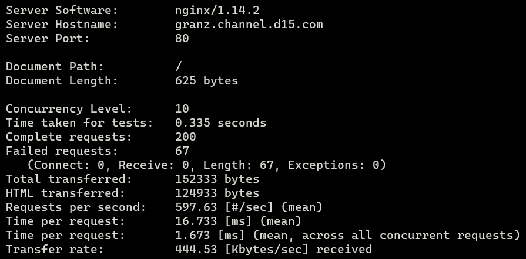

htop monitoring graph:

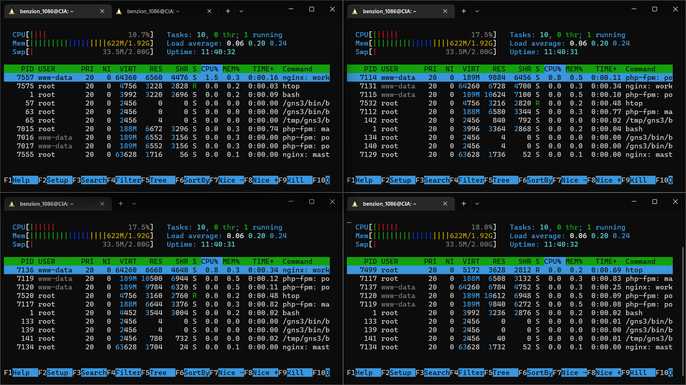

**Least Connection**

Apache Benchmark report:

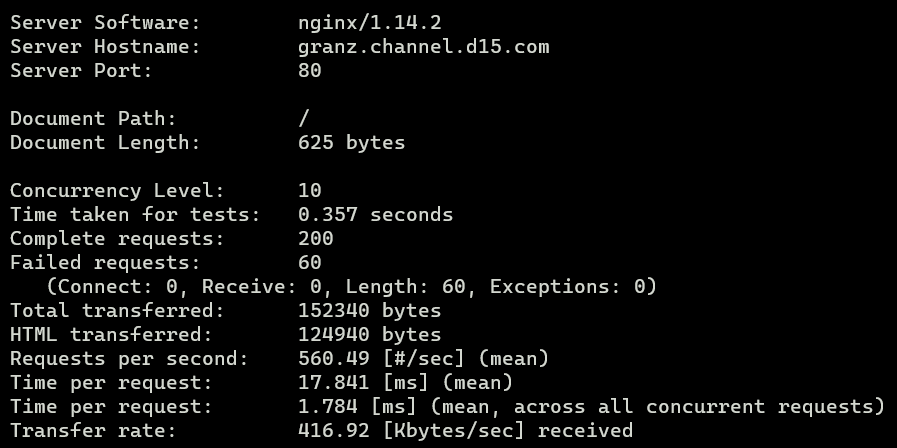

htop monitoring graph:

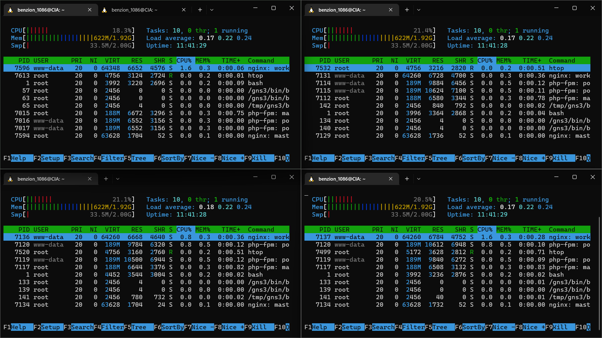

**IP Hash**

Apache Benchmark report:

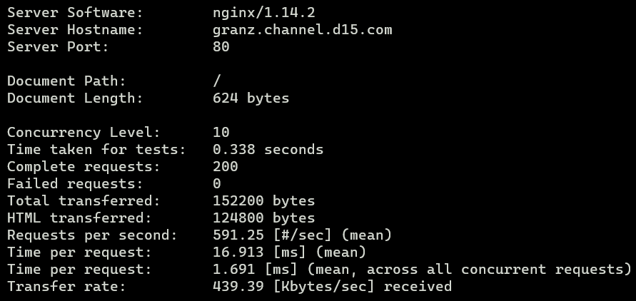

htop monitoring graph:

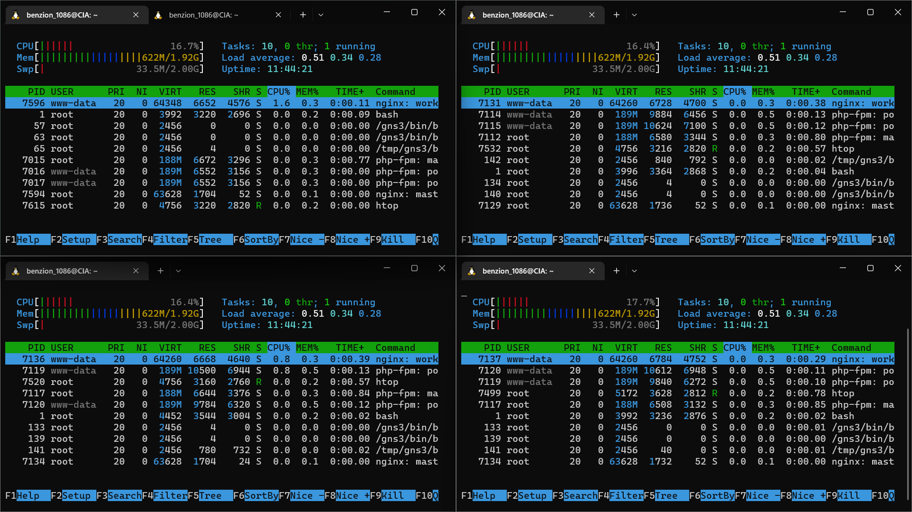

**Generic Hash**

Apache Benchmark report:

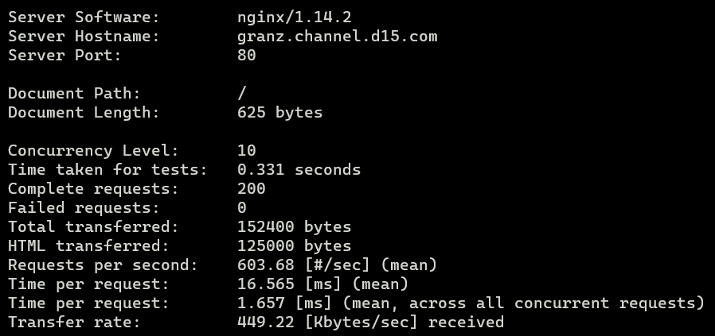

htop monitoring graph:

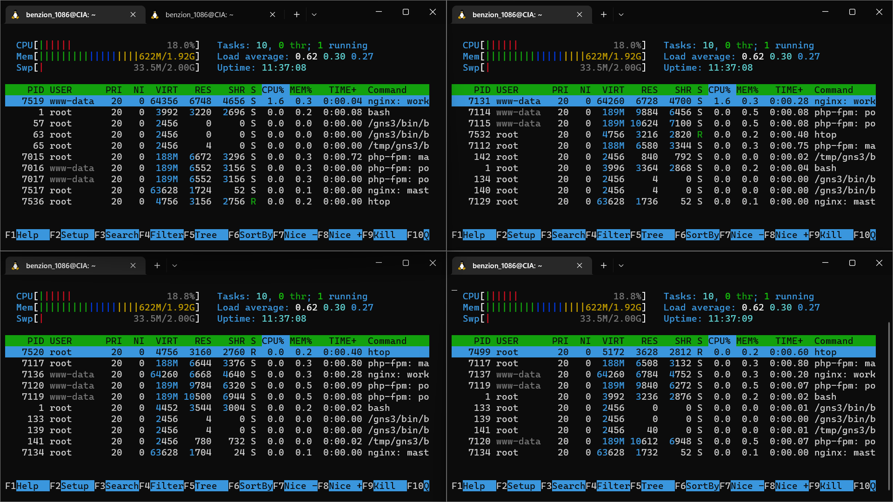

**Requests per second comparison chart for each algorithm**

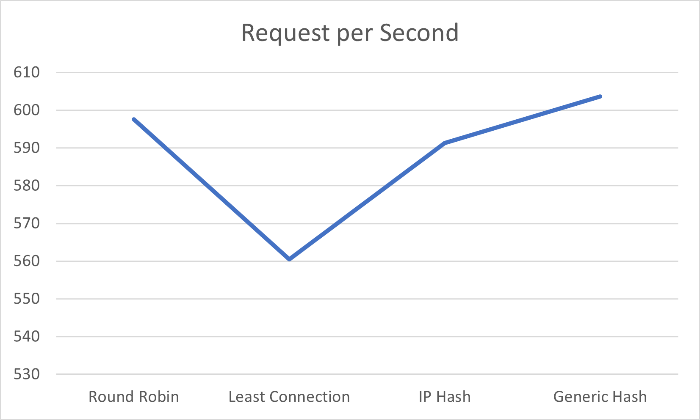

**Analysis**

Based on the benchmark data and requests-per-second chart, generic hash achieved the highest raw speed, while Round Robin and IP Hash showed very comparable throughput. Least Connection was the slowest in terms of requests per second. Furthermore, Round Robin and Least Connection encountered failed requests under stress, whereas IP Hash and Generic Hash had zero failed requests.

### Question 9
Perform benchmark testing using Round Robin across 3 workers, 2 workers, and 1 worker with 100 requests and concurrency of 10 requests/second, then compare their performance with a chart.

Benchmark command:

```sh
ab -n 100 -c 10 http://granz.channel.d15.com/
```

**3 Workers**

Apache Benchmark:

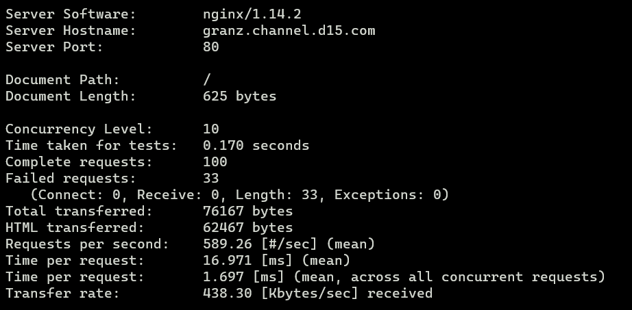

htop graph:


**2 Workers**

Apache Benchmark:

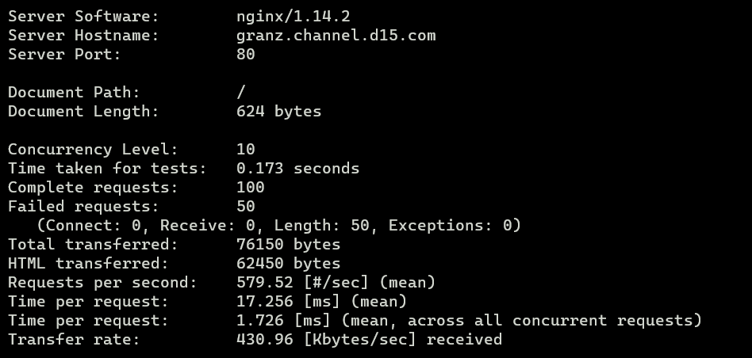

htop graph:

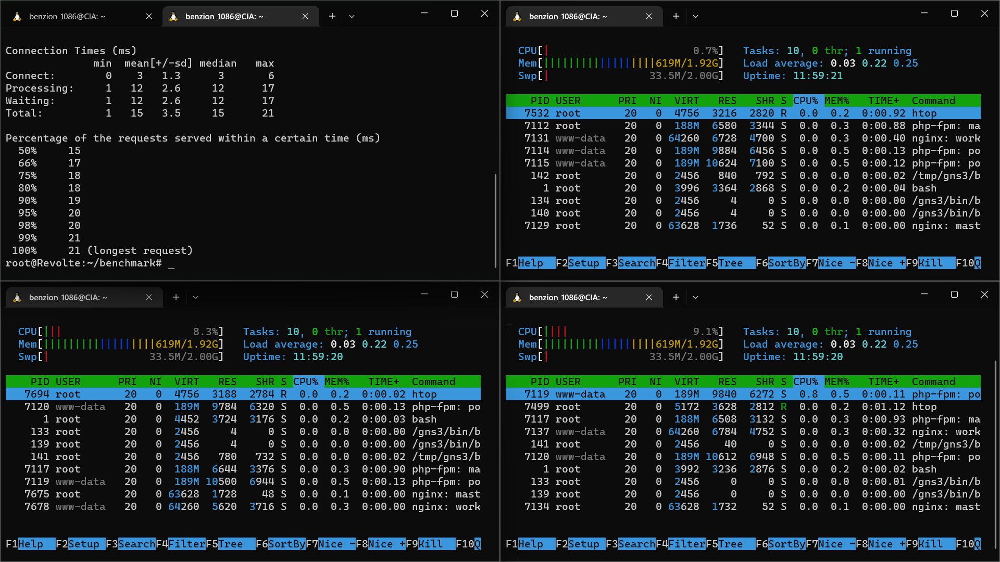

**1 Worker**

Apache Benchmark:

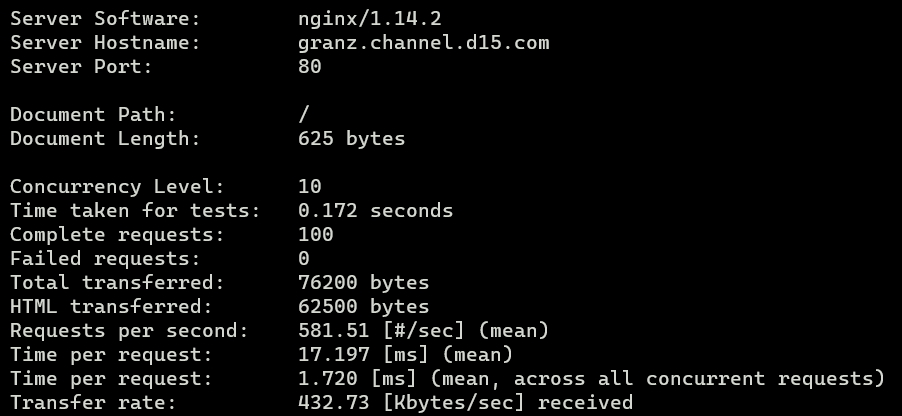

htop graph:


Comparison chart:

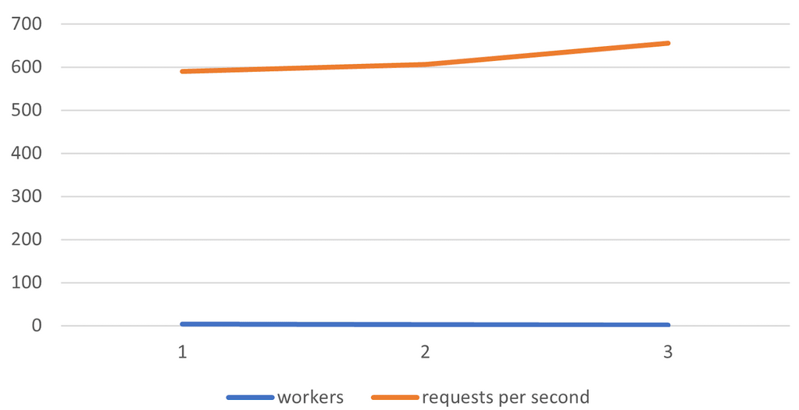

### Question 10
Configure basic HTTP authentication on the Load Balancer with username: “netics” and password: “ajkyyy” (where yyy is your group code, e.g. `ajkd15`). Save the “htpasswd” file in `/etc/nginx/rahasiakita/`.

Create the password file with:

```sh
htpasswd -b -c /etc/nginx/rahasiakita/.htpasswd netics ajkd15
```

Add the following configuration in `/etc/nginx/sites-available/lb-jarkom`:

```nginx
auth_basic "Administrator's Area";
auth_basic_user_file /etc/nginx/rahasiakita/.htpasswd;
```

Testing access to `granz.channel.d15.com` via client Sein with Lynx:

```sh
lynx http://granz.channel.d15.com/
```


Upon entering correct credentials:

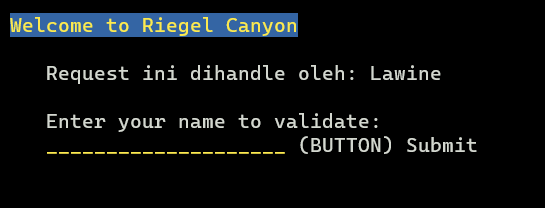

### Question 11
Proxy pass every request containing `/its` to `https://www.its.ac.id`.

Add the following location block on Eisen in `/etc/nginx/sites-available/lb-jarkom`:

```nginx
location ~ /its {
        proxy_pass https://www.its.ac.id;
        proxy_set_header Host www.its.ac.id;
        proxy_set_header X-Real-IP $remote_addr;
        proxy_set_header X-Forwarded-For $proxy_add_x_forwarded_for;
        proxy_set_header X-Forwarded-Proto $scheme;
}
```

Result when requesting `http://granz.channel.d15.com/its`:

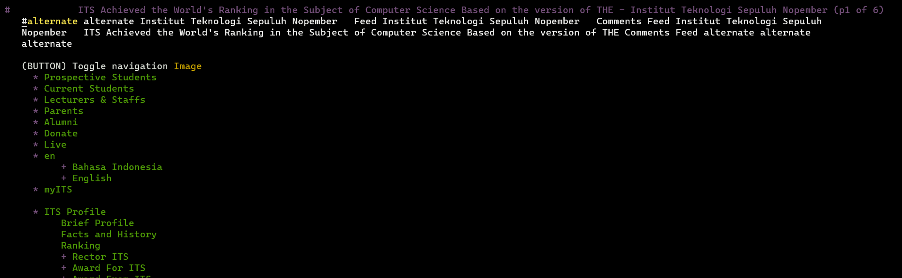

Note: Lynx is redirected directly to `http://www.its.ac.id/`.

### Question 12
Restrict Load Balancer access to only allow clients with IPs `[IP Prefix].3.69`, `[IP Prefix].3.70`, `[IP Prefix].4.167`, and `[IP Prefix].4.168`.

Add access control rules in `/etc/nginx/sites-available/lb-jarkom`:

```nginx
allow 10.29.3.69;
allow 10.29.3.70;
allow 10.29.4.167;
allow 10.29.4.168;
deny all;
```

Complete configuration for `/etc/nginx/sites-available/lb-jarkom` with Round Robin:

```nginx
upstream backend  {
        server 10.29.3.1; # Lawine IP
        server 10.29.3.2; # Linie IP
        server 10.29.3.3; # Lugner IP
}

server {
        listen 80;
        server_name granz.channel.d15.com;

        location / {
                proxy_pass http://backend;
                proxy_set_header    X-Real-IP $remote_addr;
                proxy_set_header    X-Forwarded-For $proxy_add_x_forwarded_for;
                proxy_set_header    Host $http_host;

                auth_basic "Administrator's Area";
                auth_basic_user_file /etc/nginx/rahasiakita/.htpasswd;

                allow 10.29.3.69;
                allow 10.29.3.70;
                allow 10.29.4.167;
                allow 10.29.4.168;
                deny all;
        }

        location ~ /its {
                proxy_pass https://www.its.ac.id;
                proxy_set_header Host www.its.ac.id;
                proxy_set_header X-Real-IP $remote_addr;
                proxy_set_header X-Forwarded-For $proxy_add_x_forwarded_for;
                proxy_set_header X-Forwarded-Proto $scheme;
        }

        location ~ /\.ht {
                deny all;
        }

        error_log /var/log/nginx/lb_error.log;
        access_log /var/log/nginx/lb_access.log;
}
```

Result when accessing `http://granz.channel.d15.com` from client Sein (IP 10.29.4.12 — unauthorized by the load balancer):


## Database Configuration

### Question 13
All required data is hosted on Denken and must be accessible by Frieren, Flamme, and Fern.

#### Setting DB Server, Denken
First, install MariaDB and MySQL server on Denken:

```sh
apt-get update -y
apt-get install mariadb-server -y
```

Next, configure `/etc/mysql/mariadb.conf.d/50-server.cnf` to allow external connections from Laravel workers by setting `bind-address` to `0.0.0.0`:

```ini
bind-address            = 0.0.0.0
```

Next, create the database user account:

Access the MySQL shell with root privileges:

```sh
mysql -u root
```

Execute SQL commands:

```sql
CREATE USER userd15@'%' IDENTIFIED BY 'passwordd15';
GRANT ALL PRIVILEGES ON *.* TO userd15@'%' WITH GRANT OPTION;
FLUSH PRIVILEGES;
EXIT;
```

Start the MySQL service:

```sh
service mysql start
```

## Laravel Worker

### Question 14
Install Laravel and the web application on Frieren, Flamme, and Fern, then configure the load balancer for Riegel Canyon.

#### Installing Laravel on Workers

On workers Frieren, Flamme, and Fern, install PHP 8.0, composer, git, unzip, and other dependencies:

```sh
# Update package repositories
apt-get update -y

# Install PHP 8.0
apt install -y gnupg2 ca-certificates apt-transport-https software-properties-common wget curl git unzip
wget -qO - https://packages.sury.org/php/apt.gpg | apt-key add -
echo "deb https://packages.sury.org/php/ buster main" | tee /etc/apt/sources.list.d/php.list
apt-get update -y
apt install php8.0 -y
apt install php8.0-{mysql,imap,ldap,xml,curl,mbstring,zip,fpm,cli} -y

# Start PHP-FPM service
service php8.0-fpm start

# Install Composer
curl -sS https://getcomposer.org/installer -o composer-setup.php
php composer-setup.php --install-dir=/usr/local/bin --filename=composer

# Install MariaDB client
apt-get install mariadb-client -y

# Set up Laravel project
cd /var/www
git clone https://github.com/martuafernando/laravel-praktikum-jarkom
cd /var/www/laravel-praktikum-jarkom
composer update
cp /root/dotenv /var/www/laravel-praktikum-jarkom/.env
php artisan key:generate
php artisan config:cache
php artisan migrate
php artisan db:seed
php artisan storage:link
php artisan jwt:secret
php artisan config:clear
chown -R www-data:www-data /var/www/laravel-praktikum-jarkom/storage

# Install Nginx
apt-get install nginx -y
```

Start Nginx and PHP 8.0-FPM services:

```sh
service nginx start
service php8.0-fpm start
```

Configure Nginx in `/etc/nginx/sites-available/laravel-praktikum-jarkom`:

```nginx
server {

    listen 8001;

    root /var/www/laravel-praktikum-jarkom/public;

    index index.php index.html index.htm;
    server_name _;

    location / {
            try_files $uri $uri/ /index.php?$query_string;
    }

    # Pass PHP scripts to FastCGI server
    location ~ \.php$ {
        include snippets/fastcgi-php.conf;
        fastcgi_pass unix:/var/run/php/php8.0-fpm.sock;
    }

    location ~ /\.ht {
            deny all;
    }

    error_log /var/log/nginx/implementasi_error.log;
    access_log /var/log/nginx/implementasi_access.log;
}
```

Note: Worker Frieren listens on port 8001; configure Flamme to listen on port 8002, and Fern on port 8003.

Configure the environment file in `/var/www/laravel-praktikum-jarkom/.env` on each worker:

```env
APP_NAME=Laravel
APP_ENV=local
APP_KEY=
APP_DEBUG=true
APP_URL=http://localhost

LOG_CHANNEL=stack
LOG_DEPRECATIONS_CHANNEL=null
LOG_LEVEL=debug

DB_CONNECTION=mysql
DB_HOST=10.29.2.1
DB_PORT=3306
DB_DATABASE=laravel
DB_USERNAME=userd15
DB_PASSWORD=passwordd15

BROADCAST_DRIVER=log
CACHE_DRIVER=file
FILESYSTEM_DISK=local
QUEUE_CONNECTION=sync
SESSION_DRIVER=file
SESSION_LIFETIME=120

MEMCACHED_HOST=127.0.0.1

REDIS_HOST=127.0.0.1
REDIS_PASSWORD=null
REDIS_PORT=6379

MAIL_MAILER=smtp
MAIL_HOST=mailpit
MAIL_PORT=1025
MAIL_USERNAME=null
MAIL_PASSWORD=null
MAIL_ENCRYPTION=null
MAIL_FROM_ADDRESS="hello@example.com"
MAIL_FROM_NAME="${APP_NAME}"

AWS_ACCESS_KEY_ID=
AWS_SECRET_ACCESS_KEY=
AWS_DEFAULT_REGION=us-east-1
AWS_BUCKET=
AWS_USE_PATH_STYLE_ENDPOINT=false

PUSHER_APP_ID=
PUSHER_APP_KEY=
PUSHER_APP_SECRET=
PUSHER_HOST=
PUSHER_PORT=443
PUSHER_SCHEME=https
PUSHER_APP_CLUSTER=mt1

VITE_PUSHER_APP_KEY="${PUSHER_APP_KEY}"
VITE_PUSHER_HOST="${PUSHER_HOST}"
VITE_PUSHER_PORT="${PUSHER_PORT}"
VITE_PUSHER_SCHEME="${PUSHER_SCHEME}"
VITE_PUSHER_APP_CLUSTER="${PUSHER_APP_CLUSTER}"
```

Restart Nginx on each Laravel worker:

```sh
service nginx restart
```

### Question 15
Riegel Canyon has several endpoints that need to be benchmarked with 100 requests and concurrency of 10 requests/second.
Benchmark endpoint:
`POST /auth/register`

First, configure the load balancer on Eisen in `/etc/nginx/sites-available/lb-laravel`:

```nginx
# Default using Round Robin
upstream backend_laravel  {
        server 10.29.4.1:8001; # Frieren IP
        server 10.29.4.2:8002; # Flamme IP
        server 10.29.4.3:8003; # Fern IP
}

server {
        listen 81;
        server_name riegel.canyon.d15.com;

        location / {
                proxy_pass http://backend_laravel;
                proxy_set_header    X-Real-IP $remote_addr;
                proxy_set_header    X-Forwarded-For $proxy_add_x_forwarded_for;
                proxy_set_header    Host $http_host;

                #auth_basic "Administrator's Area";
                #auth_basic_user_file /etc/nginx/rahasiakita/.htpasswd;
        }

        location ~ /\.ht {
                deny all;
        }

        error_log /var/log/nginx/lb_laravel_error.log;
        access_log /var/log/nginx/lb_laravel_access.log;
}
```

Enable the configuration:

```sh
ln -s /etc/nginx/sites-available/lb-laravel /etc/nginx/sites-enabled/
```

Restart Nginx:

```sh
service nginx restart
```

Install `apache2-utils` on the client servers:

```sh
apt-get install apache2-utils -y
```

Create `register_data.json` containing payload data for registration:

```json
{
    "username": "userd15",
    "password": "passd15"
}
```

Run the benchmark test:

```sh
ab -n 100 -c 10 -T 'application/json' -p register_data.json -g register_results.data http://riegel.canyon.d15.com:81/api/auth/register
```

Note: Since `riegel.canyon.d15.com` runs on port 81 on Eisen, specify port 81 in the URL.

Benchmark result:

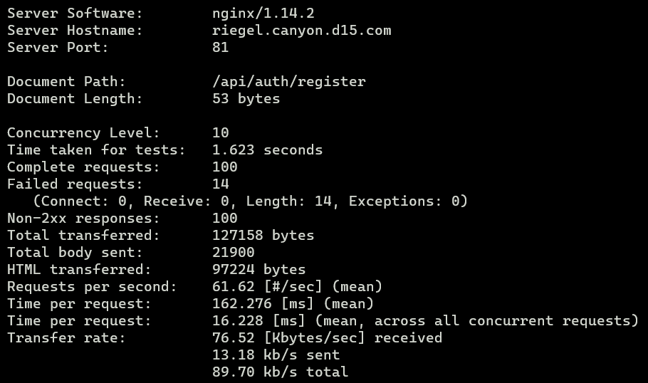

### Question 16
Perform the same benchmark test to the endpoint `POST /auth/login`.

Create `login_data.json` with the following payload:

```json
{
    "username": "userd15",
    "password": "passd15"
}
```

Execute benchmark command:

```sh
ab -n 100 -c 10 -T 'application/json' -p login_data.json -g login_results.data http://riegel.canyon.d15.com:81/api/auth/login
```

Benchmark result:

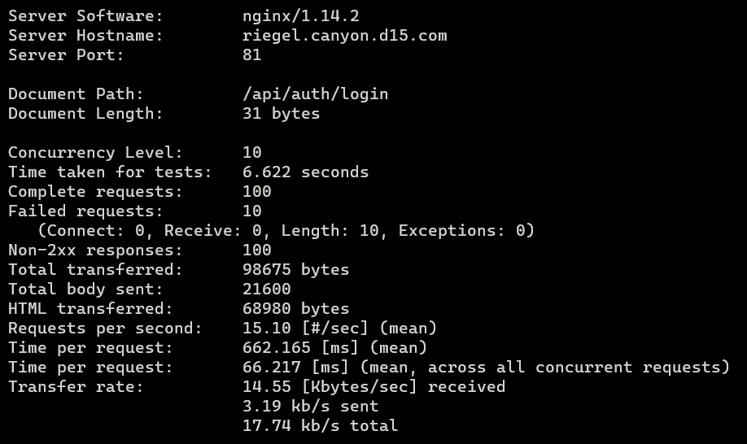

### Question 17
Perform the same benchmark test with method `GET` to route `/me`.

First, log in to obtain an authentication token:

```sh
curl -X POST -H "Content-type: application/json" -d '{"username": "userd15", "password": "passd15"}' http://riegel.canyon.d15.com:81/api/auth/login
```

Verify token validity using curl:

```sh
curl -X GET -H "Authorization: Bearer $token" http://riegel.canyon.d15.com:81/api/me
```

Note: Replace `$token` with the generated JWT token.

Run benchmark with authorization header:

```sh
ab -n 1000 -c 10 -H "Authorization: Bearer $token" http://riegel.canyon.d15.com:81/api/me
```

Benchmark result:

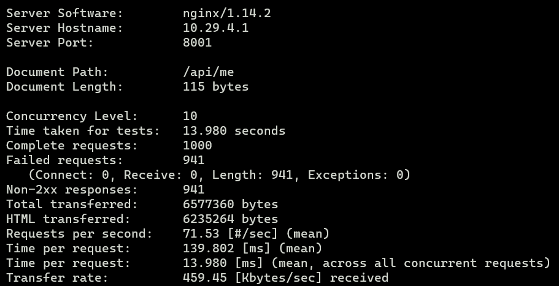

### Question 18
To ensure fair load distribution across all three nodes managing Riegel Canyon, configure Least-Conn load balancing on Eisen across Frieren, Flamme, and Fern.

Add the following upstream configuration on Eisen:

```nginx
upstream backend_laravel  {
        least_conn;
        server 10.29.4.1:8001; # Frieren IP
        server 10.29.4.2:8002; # Flamme IP
        server 10.29.4.3:8003; # Fern IP
}

server {
        listen 81;
        server_name riegel.canyon.d15.com;

        location / {
                proxy_pass http://backend_laravel;
                proxy_set_header    X-Real-IP $remote_addr;
                proxy_set_header    X-Forwarded-For $proxy_add_x_forwarded_for;
                proxy_set_header    Host $http_host;

                #auth_basic "Administrator's Area";
                #auth_basic_user_file /etc/nginx/rahasiakita/.htpasswd;
        }

        location ~ /\.ht {
                deny all;
        }

        error_log /var/log/nginx/lb_laravel_error.log;
        access_log /var/log/nginx/lb_laravel_access.log;
}
```

### Question 19
To improve worker performance, tune PHP-FPM on Frieren, Flamme, and Fern by adjusting:
- pm.max_children
- pm.start_servers
- pm.min_spare_servers
- pm.max_spare_servers

Perform three experimental configurations, testing each with 100 requests and concurrency of 10 requests/second, then analyze the results.

Testing command:

```sh
ab -n 100 -c 10 -T 'application/json' -p login_data.json -g login_results.data http://riegel.canyon.d15.com:81/api/auth/login
```

Tune settings in `/etc/php/8.0/fpm/pool.d/www.conf` on each Laravel worker. Default configuration:

```ini
[www]
user = www-data
group = www-data
listen = /run/php/php8.0-fpm.sock
listen.owner = www-data
listen.group = www-data
php_admin_value[disable_functions] = exec,passthru,shell_exec,system
php_admin_flag[allow_url_fopen] = off

; Choose how the process manager will control the number of child processes.

pm = dynamic
pm.max_children = 5
pm.start_servers = 2
pm.min_spare_servers = 1
pm.max_spare_servers = 3
```

Default benchmark result:

```
Server Software:    	nginx/1.14.2
Server Hostname:    	10.29.2.2
Server Port:        	81

Document Path:      	/api/auth/login
Document Length:    	169 bytes

Concurrency Level:  	10
Time taken for tests:   0.195 seconds
Complete requests:  	100
Failed requests:    	0
Non-2xx responses:  	100
Total transferred:  	31900 bytes
Total body sent:    	20400
HTML transferred:   	16900 bytes
Requests per second:	512.10 [#/sec] (mean)
Time per request:   	19.528 [ms] (mean)
Time per request:   	1.953 [ms] (mean, across all concurrent requests)
Transfer rate:      	159.53 [Kbytes/sec] received
                    	102.02 kb/s sent
                    	261.55 kb/s total
```

**Configuration Round 1:**

```ini
[www]
user = www-data
group = www-data
listen = /run/php/php8.0-fpm.sock
listen.owner = www-data
listen.group = www-data
php_admin_value[disable_functions] = exec,passthru,shell_exec,system
php_admin_flag[allow_url_fopen] = off

; Process manager settings

pm.max_children = 20
pm.start_servers = 4
pm.min_spare_servers = 3
pm.max_spare_servers = 12
```

Round 1 benchmark result:

```
Server Software:    	nginx/1.14.2
Server Hostname:    	10.29.2.2
Server Port:        	81

Document Path:      	/api/auth/login
Document Length:    	169 bytes

Concurrency Level:  	10
Time taken for tests:   0.301 seconds
Complete requests:  	100
Failed requests:    	0
Non-2xx responses:  	100
Total transferred:  	31900 bytes
Total body sent:    	20400
HTML transferred:   	16900 bytes
Requests per second:	332.15 [#/sec] (mean)
Time per request:   	30.107 [ms] (mean)
Time per request:   	3.011 [ms] (mean, across all concurrent requests)
Transfer rate:      	103.47 [Kbytes/sec] received
                    	66.17 kb/s sent
                    	169.64 kb/s total
```

**Configuration Round 2:**

```ini
[www]
user = www-data
group = www-data
listen = /run/php/php8.0-fpm.sock
listen.owner = www-data
listen.group = www-data
php_admin_value[disable_functions] = exec,passthru,shell_exec,system
php_admin_flag[allow_url_fopen] = off

; Process manager settings

pm.max_children = 40
pm.start_servers = 6
pm.min_spare_servers = 5
pm.max_spare_servers = 14
```

Round 2 benchmark result:

```
Server Software:    	nginx/1.14.2
Server Hostname:    	10.29.2.2
Server Port:        	81

Document Path:      	/api/auth/login
Document Length:    	169 bytes

Concurrency Level:  	10
Time taken for tests:   0.290 seconds
Complete requests:  	100
Failed requests:    	0
Non-2xx responses:  	100
Total transferred:  	31900 bytes
Total body sent:    	20400
HTML transferred:   	16900 bytes
Requests per second:	344.25 [#/sec] (mean)
Time per request:   	29.049 [ms] (mean)
Time per request:   	2.905 [ms] (mean, across all concurrent requests)
Transfer rate:      	107.24 [Kbytes/sec] received
                    	68.58 kb/s sent
                    	175.82 kb/s total
```

**Configuration Round 3:**

```ini
[www]
user = www-data
group = www-data
listen = /run/php/php8.0-fpm.sock
listen.owner = www-data
listen.group = www-data
php_admin_value[disable_functions] = exec,passthru,shell_exec,system
php_admin_flag[allow_url_fopen] = off

; Process manager settings

pm.max_children = 60
pm.start_servers = 8
pm.min_spare_servers = 7
pm.max_spare_servers = 18
```

Round 3 benchmark result:

```
Server Software:    	nginx/1.14.2
Server Hostname:    	10.29.2.2
Server Port:        	81

Document Path:      	/api/auth/login
Document Length:    	169 bytes

Concurrency Level:  	10
Time taken for tests:   0.290 seconds
Complete requests:  	100
Failed requests:    	0
Non-2xx responses:  	100
Total transferred:  	31900 bytes
Total body sent:    	20400
HTML transferred:   	16900 bytes
Requests per second:	345.31 [#/sec] (mean)
Time per request:   	28.959 [ms] (mean)
Time per request:   	2.896 [ms] (mean, across all concurrent requests)
Transfer rate:      	107.57 [Kbytes/sec] received
                    	68.79 kb/s sent
                    	176.37 kb/s total
```

### Question 20
To further improve worker performance, implement Least-Conn on Eisen in combination with PHP-FPM tuning. Benchmark with 100 requests and concurrency of 10 requests/second.

Configure Least-Conn load balancing in `/etc/nginx/sites-available/lb-laravel`:

```nginx
upstream backend_laravel  {
        least_conn;
        server 10.29.4.1:8001; # Frieren IP
        server 10.29.4.2:8002; # Flamme IP
        server 10.29.4.3:8003; # Fern IP
}

server {
        listen 81;
        server_name riegel.canyon.d15.com;

        location / {
                proxy_pass http://backend_laravel;
                proxy_set_header    X-Real-IP $remote_addr;
                proxy_set_header    X-Forwarded-For $proxy_add_x_forwarded_for;
                proxy_set_header    Host $http_host;

                #auth_basic "Administrator's Area";
                #auth_basic_user_file /etc/nginx/rahasiakita/.htpasswd;
        }

        location ~ /\.ht {
                deny all;
        }

        error_log /var/log/nginx/lb_laravel_error.log;
        access_log /var/log/nginx/lb_laravel_access.log;
}
```

Run benchmark with 100 requests and concurrency of 10 requests/second:

First, authenticate to retrieve the token:

```sh
curl -X POST -H "Content-type: application/json" -d '{"username": "userd15", "password": "passd15"}' http://riegel.canyon.d15.com:81/api/auth/login
```

Run Apache Benchmark:

```sh
ab -n 100 -c 10 -H "Authorization: Bearer $token" http://riegel.canyon.d15.com:81/api/me
```

Benchmark results:

```
Server Software:    	nginx/1.14.2
Server Hostname:    	10.29.2.2
Server Port:        	81

Document Path:      	/api/auth/login
Document Length:    	169 bytes

Concurrency Level:  	10
Time taken for tests:   0.236 seconds
Complete requests:  	100
Failed requests:    	0
Non-2xx responses:  	100
Total transferred:  	31900 bytes
Total body sent:    	20400
HTML transferred:   	16900 bytes
Requests per second:	423.23 [#/sec] (mean)
Time per request:   	23.628 [ms] (mean)
Time per request:   	2.363 [ms] (mean, across all concurrent requests)
Transfer rate:      	131.85 [Kbytes/sec] received
                    	84.31 kb/s sent
                    	216.16 kb/s total
```
