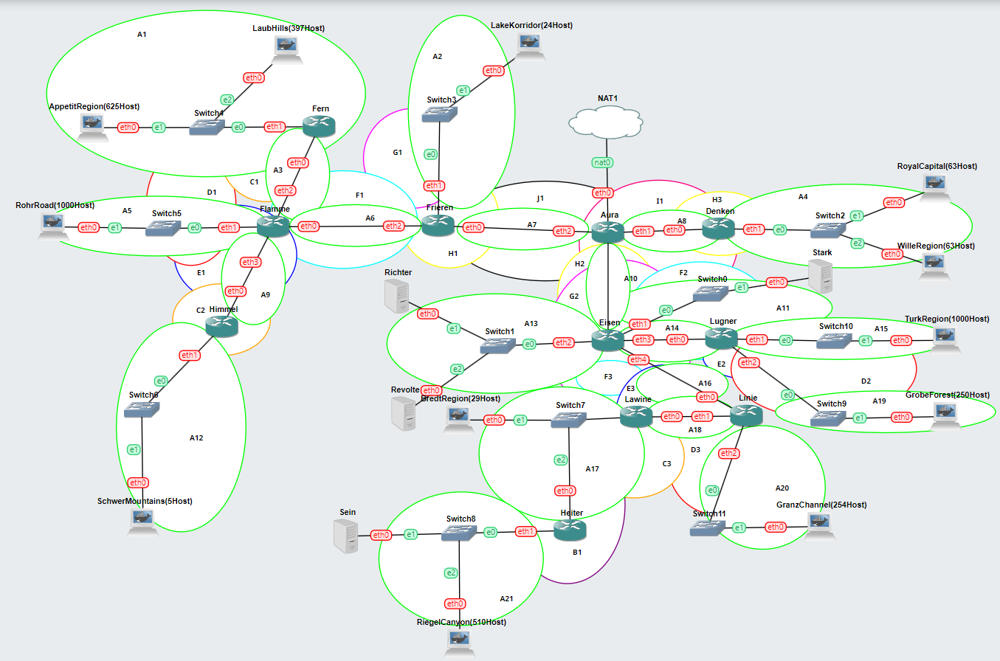
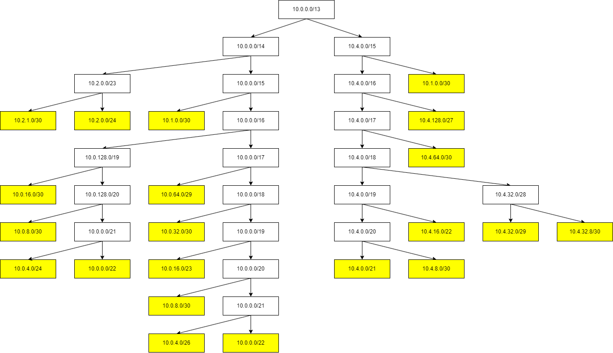
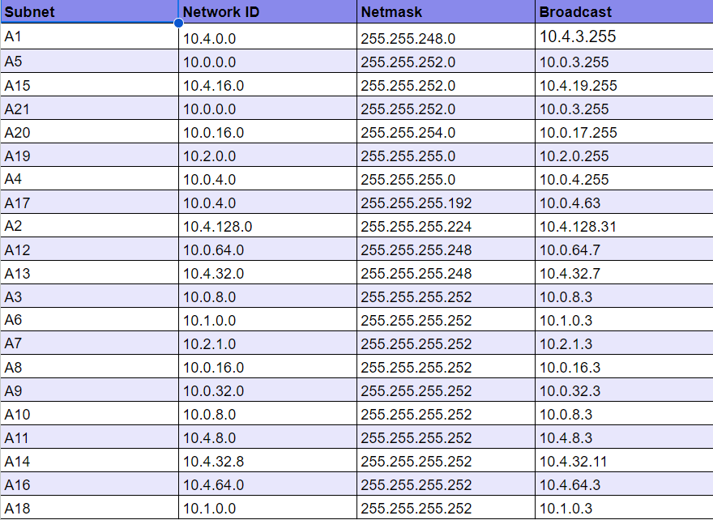
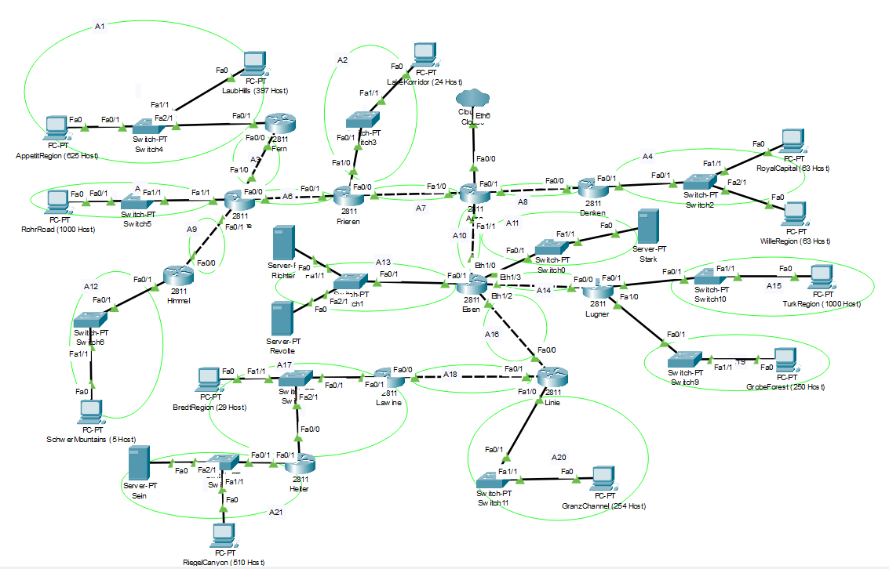
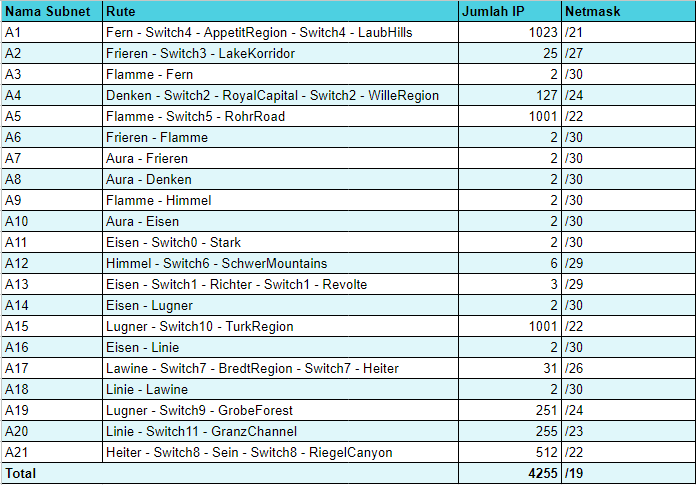
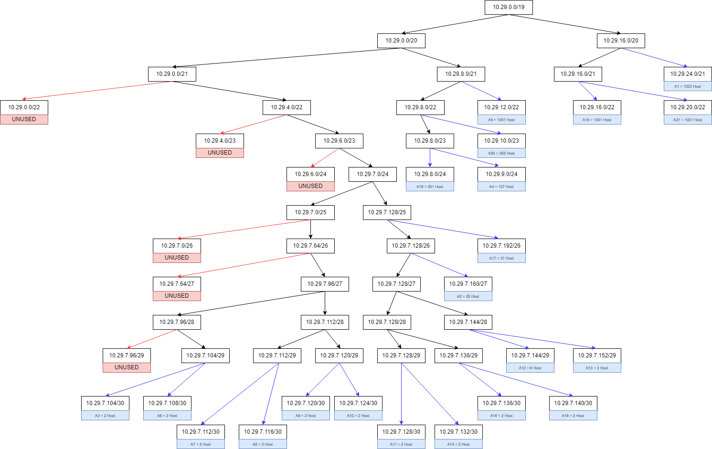
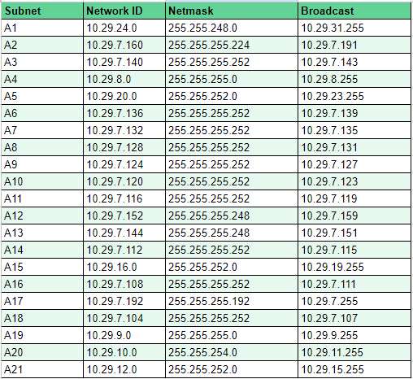
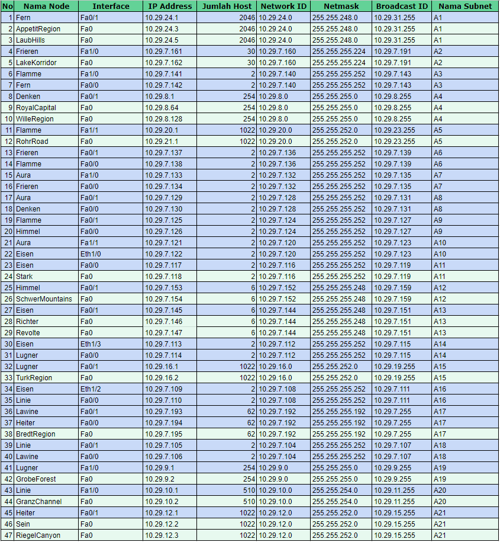
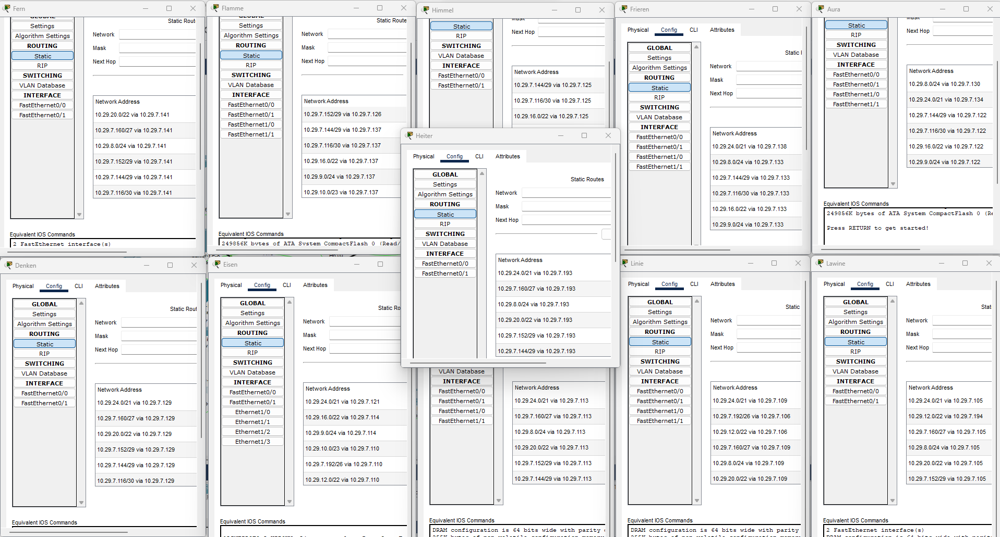

# **Network Subnetting and Routing with CIDR and VLSM - Group D15**

## Table of Contents

- [CIDR Configuration on GNS3](#cidr-configuration-on-gns3)
- [VLSM Configuration on CPT](#vlsm-configuration-on-cpt)

## CIDR Configuration on GNS3

### 1. Identify subnets in the topology and label netmasks for each subnet

### 2. Calculate IP allocation tree based on the subnet aggregation performed

Based on the calculation, the resulting IP allocation is as follows:

## VLSM Configuration on CPT

### 1. Identify subnets in the topology and label netmasks for each subnet

### 2. Calculate the number of clients per subnet

### 3. Construct the VLSM Tree

### 4. Allocation of NID, Netmask, and BID for each subnet

### 5. Client IP allocation per subnet

### 6. Routing via routers to connect all subnets

> The routing snippet above is only a small portion of the routing configured on each router. For complete details, please refer to the provided `.pkt` file.