# **Advanced Multi-Subnet Routing, DHCP Infrastructure, and IPTables Firewall Security - Group D15**

## Table of Contents

- [Prerequisites](#prerequisites)
  - [Topology Setup](#topology-setup)
  - [Subnetting with VLSM](#subnetting-with-vlsm)
  - [Routing](#routing)
  - [Setup DHCP Server](#setup-dhcp-server)
  - [Setup DHCP Relay](#setup-dhcp-relay)
  - [Setup DNS Server](#setup-dns-server)
  - [Setup Web Server](#setup-web-server)
- [Question 1](#question-1)
- [Question 2](#question-2)
- [Question 3](#question-3)
- [Question 4](#question-4)
- [Question 5](#question-5)
- [Question 6](#question-6)
- [Question 7](#question-7)
- [Question 8](#question-8)
- [Question 9](#question-9)
- [Question 10](#question-10)

## Prerequisites

Below are the preparations required before diving into the lab tasks.

### Topology Setup

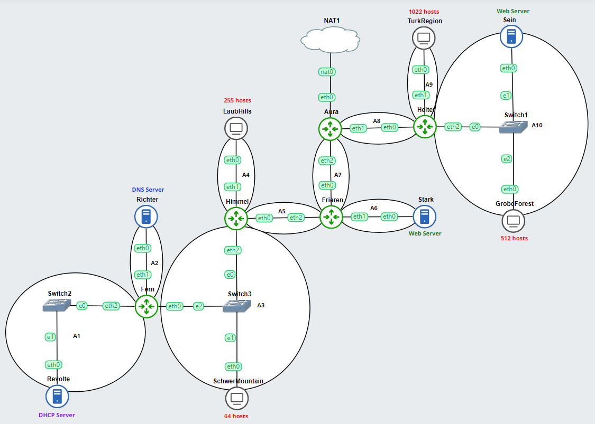

Topology details:

- Richter is the DNS Server
- Revolte is the DHCP Server
- Sein and Stark are Web Servers
- Number of hosts on SchwerMountain is 64
- Number of hosts on LaubHills is 255
- Number of hosts on TurkRegion is 1022
- Number of hosts on GrobeForest is 512

### Subnetting with VLSM

The subnetting spreadsheet can be accessed via <a href="https://docs.google.com/spreadsheets/d/16ojlqLXfdEohJvJMFsAyd2HqNdLfOEMsJbRg7eYrSY4/edit?usp=sharing">this link</a>.

Based on the information provided in the questions, we calculate the required number of IP addresses for each subnet along with the optimal prefix length for the allocated IP count:

| Subnet Name | Route                                              | Required IPs | Netmask |
| ----------- | -------------------------------------------------- | ------------ | ------- |
| A1          | Fern - Switch2 - Revolte                           | 2            | /30     |
| A2          | Fern - Richter                                     | 2            | /30     |
| A3          | Himmel - Switch3 - SchwerMountain - Switch3 - Fern | 66           | /25     |
| A4          | Himmel - LaubHills                                 | 256          | /23     |
| A5          | Frieren - Himmel                                   | 2            | /30     |
| A6          | Frieren - Stark                                    | 2            | /30     |
| A7          | Aura - Frieren                                     | 2            | /30     |
| A8          | Aura - Heiter                                      | 2            | /30     |
| A9          | Heiter - TurkRegion                                | 1023         | /21     |
| A10         | Heiter - Switch1 - Sein - Switch1 - GrobeForest    | 514          | /22     |
| Total       |                                                    | 1871         | /21     |

From the table above, we construct the VLSM tree as follows:

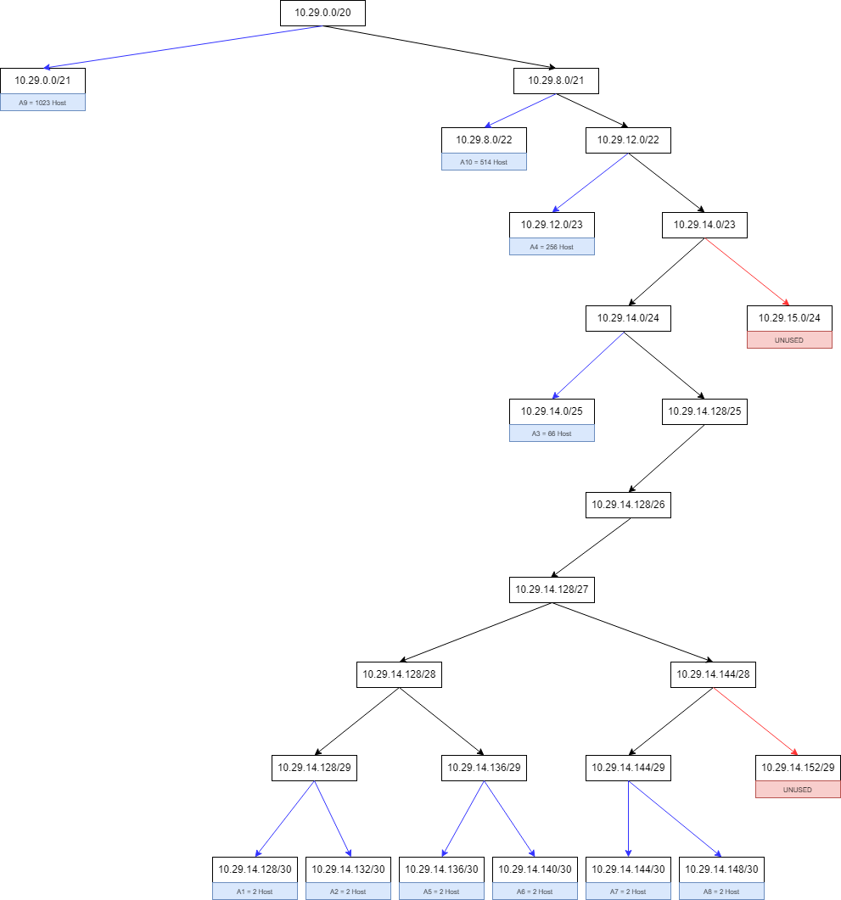

The subnetting results from the VLSM tree are mapped into the following table:

| Subnet | Network ID   | Netmask         | Broadcast    |
| ------ | ------------ | --------------- | ------------ |
| A1     | 10.29.14.128 | 255.255.255.252 | 10.29.14.131 |
| A2     | 10.29.14.132 | 255.255.255.252 | 10.29.14.135 |
| A3     | 10.29.14.0   | 255.255.255.128 | 10.29.14.127 |
| A4     | 10.29.12.0   | 255.255.254.0   | 10.29.13.255 |
| A5     | 10.29.14.136 | 255.255.255.252 | 10.29.14.139 |
| A6     | 10.29.14.140 | 255.255.255.252 | 10.29.14.143 |
| A7     | 10.29.14.144 | 255.255.255.252 | 10.29.14.147 |
| A8     | 10.29.14.148 | 255.255.255.252 | 10.29.14.151 |
| A9     | 10.29.0.0    | 255.255.248.0   | 10.29.7.255  |
| A10    | 10.29.8.0    | 255.255.252.0   | 10.29.11.255 |

After obtaining the NID, BID, and netmask for each subnet, below is the IP address assignment for each node:

| No  | Node Name      | Interface | IP Address               | Host Count  | Network ID   | Netmask         | Broadcast ID | Subnet Name |
| --- | -------------- | --------- | ------------------------ | ----------- | ------------ | --------------- | ------------ | ----------- |
| 1   | Fern           | eth2      | 10.29.14.129             | 2           | 10.29.14.128 | 255.255.255.252 | 10.29.14.131 | A1          |
| 2   | Revolte        | eth0      | 10.29.14.130             | 2           | 10.29.14.128 | 255.255.255.252 | 10.29.14.131 | A1          |
| 3   | Fern           | eth1      | 10.29.14.133             | 2           | 10.29.14.132 | 255.255.255.252 | 10.29.14.135 | A2          |
| 4   | Richter        | eth0      | 10.29.14.134             | 2           | 10.29.14.132 | 255.255.255.252 | 10.29.14.135 | A2          |
| 5   | Himmel         | eth2      | 10.29.14.1               | 126         | 10.29.14.0   | 255.255.255.128 | 10.29.14.127 | A3          |
| 6   | SchwerMountain | eth0      | 10.29.14.3 - 10.29.14.66 | 126         | 10.29.14.0   | 255.255.255.128 | 10.29.14.127 | A3          |
| 7   | Fern           | eth0      | 10.29.14.2               | 126         | 10.29.14.0   | 255.255.255.128 | 10.29.14.127 | A3          |
| 8   | Himmel         | eth1      | 10.29.12.1               | 510         | 10.29.12.0   | 255.255.254.0   | 10.29.13.255 | A4          |
| 9   | LaubHills      | eth0      | 10.29.12.2 - 10.29.13.0  | 510         | 10.29.12.0   | 255.255.254.0   | 10.29.13.255 | A4          |
| 10  | Frieren        | eth2      | 10.29.14.137             | 2           | 10.29.14.136 | 255.255.255.252 | 10.29.14.139 | A5          |
| 11  | Himmel         | eth0      | 10.29.14.138             | 2           | 10.29.14.136 | 255.255.255.252 | 10.29.14.139 | A5          |
| 12  | Frieren        | eth1      | 10.29.14.141             | 2           | 10.29.14.140 | 255.255.255.252 | 10.29.14.143 | A6          |
| 13  | Stark          | eth0      | 10.29.14.142             | 2           | 10.29.14.140 | 255.255.255.252 | 10.29.14.143 | A6          |
| 14  | Aura           | eth2      | 10.29.14.145             | 2           | 10.29.14.144 | 255.255.255.252 | 10.29.14.147 | A7          |
| 15  | Frieren        | eth0      | 10.29.14.146             | 2           | 10.29.14.144 | 255.255.255.252 | 10.29.14.147 | A7          |
| 16  | Aura           | eth1      | 10.29.14.149             | 2           | 10.29.14.148 | 255.255.255.252 | 10.29.14.151 | A8          |
| 17  | Heiter         | eth0      | 10.29.14.150             | 2           | 10.29.14.148 | 255.255.255.252 | 10.29.14.151 | A8          |
| 18  | Heiter         | eth1      | 10.29.0.1                | 2046        | 10.29.0.0    | 255.255.248.0   | 10.29.7.255  | A9          |
| 19  | TurkRegion     | eth0      | 10.29.0.2 - 10.29.4.0    | 2046        | 10.29.0.0    | 255.255.248.0   | 10.29.7.255  | A9          |
| 20  | Heiter         | eth2      | 10.29.8.1                | 1022        | 10.29.8.0    | 255.255.252.0   | 10.29.11.255 | A10         |
| 21  | Sein           | eth0      | 10.29.8.2                | 1022        | 10.29.8.0    | 255.255.252.0   | 10.29.11.255 | A10         |
| 22  | GrobeForest    | eth0      | 10.29.8.3 - 10.29.10.3   | 1022        | 10.29.8.0    | 255.255.252.0   | 10.29.11.255 | A10         |

### Routing

Below are the static routing commands configured on each router in the topology:

> Fern

```sh
route add -net 0.0.0.0 netmask 0.0.0.0 gw 10.29.14.1
```

> Himmel

```sh
route add -net 0.0.0.0 netmask 0.0.0.0 gw 10.29.14.137
route add -net 10.29.14.128 netmask 255.255.255.252 gw 10.29.14.2
route add -net 10.29.14.132 netmask 255.255.255.252 gw 10.29.14.2
```

> Frieren

```sh
route add -net 0.0.0.0 netmask 0.0.0.0 gw 10.29.14.145
route add -net 10.29.14.128 netmask 255.255.255.252 gw 10.29.14.138
route add -net 10.29.14.132 netmask 255.255.255.252 gw 10.29.14.138
route add -net 10.29.14.0 netmask 255.255.255.128 gw 10.29.14.138
route add -net 10.29.12.0 netmask 255.255.254.0 gw 10.29.14.138
```

> Aura

```sh
route add -net 10.29.14.128 netmask 255.255.255.252 gw 10.29.14.146
route add -net 10.29.14.132 netmask 255.255.255.252 gw 10.29.14.146
route add -net 10.29.14.0 netmask 255.255.255.128 gw 10.29.14.146
route add -net 10.29.12.0 netmask 255.255.254.0 gw 10.29.14.146
route add -net 10.29.14.136 netmask 255.255.255.252 gw 10.29.14.146
route add -net 10.29.14.140 netmask 255.255.255.252 gw 10.29.14.146
route add -net 10.29.0.0 netmask 255.255.248.0 gw 10.29.14.150
route add -net 10.29.8.0 netmask 255.255.252.0 gw 10.29.14.150
```

> Heiter

```sh
route add -net 0.0.0.0 netmask 0.0.0.0 gw 10.29.14.149
```

### Setup DHCP Server

#### Install isc-dhcp-server

```sh
apt-get update && apt-get install isc-dhcp-server -y
```

#### Configure DHCP Server

> /etc/default/isc-dhcp-server

```sh
INTERFACESv4="eth0"
INTERFACESv6=""
```

> /etc/dhcp/dhcpd.conf

```dhcpd
subnet 10.29.14.128 netmask 255.255.255.252 {
}

subnet 10.29.14.132 netmask 255.255.255.252 {
}

subnet 10.29.14.0 netmask 255.255.255.128 {
	range 10.29.14.2 10.29.14.126;
    option routers 10.29.14.2;
    option broadcast-address 10.29.14.127;
    option domain-name-servers 192.168.122.1;
    default-lease-time 600;
    max-lease-time 7200;
}

subnet 10.29.12.0 netmask 255.255.254.0 {
	range 10.29.12.2 10.29.13.254;
    option routers 10.29.12.1;
    option broadcast-address 10.29.13.255;
    option domain-name-servers 192.168.122.1;
    default-lease-time 600;
    max-lease-time 7200;
}

subnet 10.29.14.136 netmask 255.255.255.252 {}

subnet 10.29.14.140 netmask 255.255.255.252 {}

subnet 10.29.14.144 netmask 255.255.255.252 {}

subnet 10.29.14.148 netmask 255.255.255.252 {}

subnet 10.29.0.0 netmask 255.255.248.0 {
	range 10.29.0.2 10.29.7.254;
    option routers 10.29.0.1;
    option broadcast-address 10.29.7.255;
    option domain-name-servers 192.168.122.1;
    default-lease-time 600;
    max-lease-time 7200;
}

subnet 10.29.8.0 netmask 255.255.252.0 {
	range 10.29.8.2 10.29.11.254;
    option routers 10.29.8.1;
    option broadcast-address 10.29.11.255;
    option domain-name-servers 192.168.122.1;
    default-lease-time 600;
    max-lease-time 7200;
}
```

#### Start DHCP Server

```sh
service isc-dhcp-server start
```

### Setup DHCP Relay

#### Install isc-dhcp-relay

```sh
apt-get update && apt-get install isc-dhcp-relay -y
```

#### Configure DHCP Relay

> /etc/sysctl.conf

```ini
net.ipv4.ip_forward=1
```

> /etc/default/isc-dhcp-relay

```sh
# Target DHCP server to forward requests to
SERVERS="10.29.14.130"

# Interfaces where DHCP relay should listen
INTERFACES="eth1 eth2"

# Additional options passed to daemon
OPTIONS=""
```

#### Start DHCP Relay

```sh
service isc-dhcp-relay start
```

### Setup DNS Server

#### Install bind9

```sh
apt-get update && apt-get install bind9 -y
```

#### Configure DNS Server

> /etc/bind/named.conf.local

```bind
zone "jarkomd15.com" {
        type master;
        file "/etc/bind/jarkom/jarkomd15.com";
};
```

> /etc/bind/jarkom/jarkomd15.com

```bind
;
; BIND data file for local loopback interface
;
$TTL    604800
@       IN      SOA     jarkomd15.com. root.jarkomd15.com. (
                              2         ; Serial
                         604800         ; Refresh
                          86400         ; Retry
                        2419200         ; Expire
                         604800 )       ; Negative Cache TTL
;
@       IN      NS      jarkomd15.com.
@       IN      A       10.29.14.142
@       IN      AAAA    ::1
```

> /etc/bind/named.conf.options

```bind
options {
        directory "/var/cache/bind";

        forwarders {
            192.168.122.1;
        };

        allow-query{any;};

        listen-on-v6 { any; };
};
```

This configuration permits every host and router using this DNS server IP to access the internet.

#### Start DNS Server

```sh
service bind9 start
```

### Setup Web Server

#### Install apache2

```sh
sudo apt-get update && apt-get install apache2 -y
```

#### Configure Web Server

> /etc/apache2/sites-available/jarkomd15.com.conf

```apache
<VirtualHost *:8080>
        ServerName jarkomd15.com
        ServerAlias www.jarkomd15.com

        ServerAdmin webmaster@localhost
        DocumentRoot /var/www/jarkom

        ErrorLog ${APACHE_LOG_DIR}/error.log
        CustomLog ${APACHE_LOG_DIR}/access.log combined
</VirtualHost>
```

Enable the site:

```sh
a2ensite jarkomd15.com.conf
```

> /etc/apache2/ports.conf

```apache
Listen 80
Listen 8080

<IfModule ssl_module>
        Listen 443
</IfModule>

<IfModule mod_gnutls.c>
        Listen 443
</IfModule>
```

> /var/www/jarkom/index.html

```html
Welcome to JarkomD15 Web Page!
```

#### Start Web Server

```sh
service apache2 start
```

## Question 1

To allow the topology you created to access external networks, configure Aura using IPTables without using MASQUERADE.

> Solution

To enable external access for the entire topology, configure IPTables NAT on the main edge router connected to external networks, which is `Aura`:

```sh
iptables -t nat -A POSTROUTING -o eth0 -j SNAT --to-source 192.168.122.2
```

> Testing

Ping Google from one of the hosts configured with the DNS server IP:

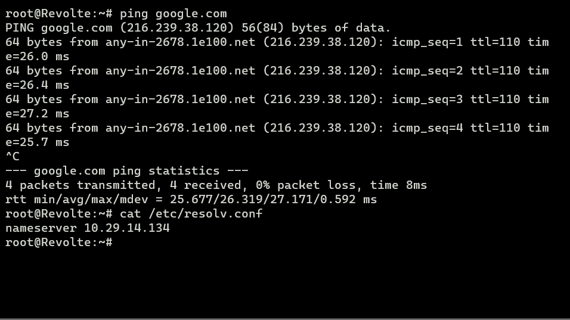

## Question 2

You are requested to drop all TCP and UDP traffic except port 8080 on TCP.

> Solution

To drop all TCP and UDP traffic except port 8080 on TCP, apply IPTables rules on the web server where we want to filter traffic (in this case, `Sein`):

```sh
# Drop all TCP requests except port 8080
iptables -A INPUT -p tcp --dport 8080 -j ACCEPT
iptables -A INPUT -p tcp --dport 0:8079 -j DROP
iptables -A INPUT -p tcp --dport 8081:65535 -j DROP

# Drop all UDP requests
iptables -A INPUT -p udp -j DROP
```

> Testing

Access the domain `its.jarkomd15.com` configured on the DNS server on port 80, and then on port 8080:

Port 80:

```sh
lynx its.jarkomd15.com
```


As seen above, port 80 on Sein cannot be accessed.

Port 8080:

```sh
lynx its.jarkomd15.com:8080
```

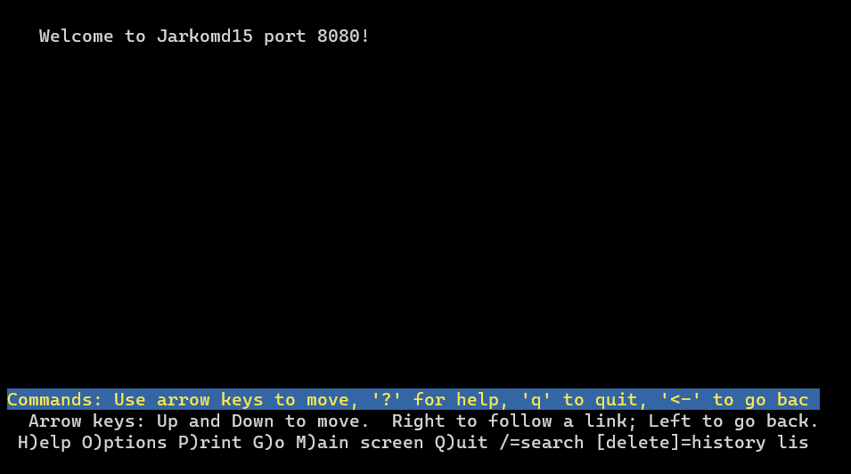

Port 8080 on Sein is successfully accessed.

## Question 3

The North Area Chieftain requests limiting ping requests to the DHCP and DNS Servers to a maximum of 3 devices simultaneously; excess requests must be dropped.

> Solution

To limit pings to the DHCP and DNS servers to at most 3 simultaneous devices, configure IPTables on the DHCP server (`Revolte`) and DNS server (`Richter`):

```sh
iptables -A INPUT -p icmp -m connlimit --connlimit-above 3 --connlimit-mask 0 -j DROP
```

> Testing

Ping the DHCP server `Revolte` using 3 devices simultaneously, then add a 4th device.

Ping results from 3 devices:

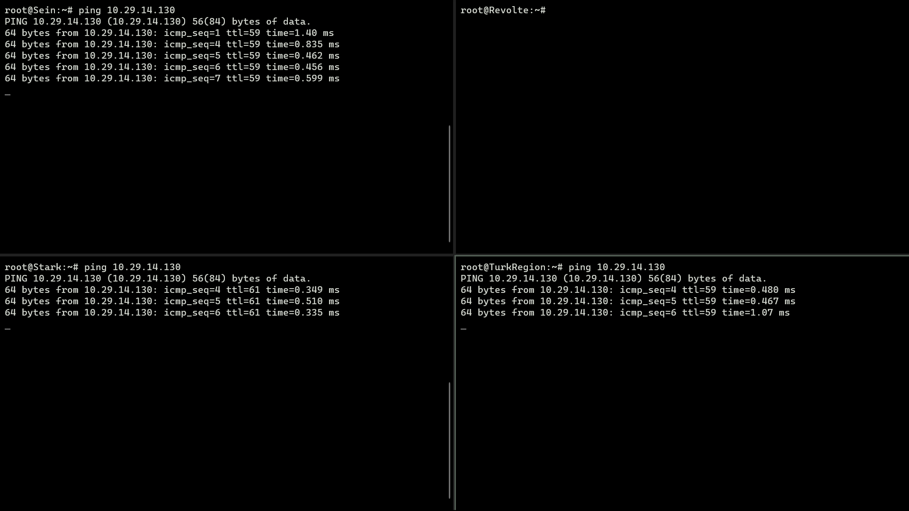

All 3 pings run simultaneously without issue.

Ping results from 4 devices:

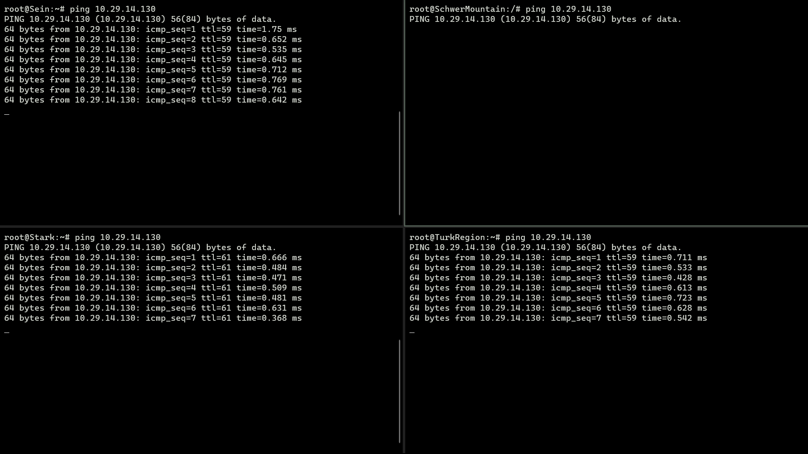

The 4th device is dropped and all ping streams are halted/restricted by the rule.

## Question 4

Restrict SSH connections to the Web Server so that only users residing in GrobeForest can access it.

> Solution

To restrict SSH access to only users in GrobeForest, configure IPTables on the web server (`Stark`):

```sh
# Allow SSH connections from the specified IP range
iptables -A INPUT -p tcp --dport 22 -i eth0 -m iprange --src-range 10.29.8.2-10.29.11.254 -j ACCEPT

# Drop SSH connections from all other IP addresses
iptables -A INPUT -p tcp --dport 22 -i eth0 -j DROP
```

> Testing

Install netcat on GrobeForest, Stark, and another host:

```sh
apt-get install netcat -y
```

Run listening command on Stark:

```sh
nc -l -p 22
```

Run connection command from GrobeForest and from another host:

```sh
nc 10.29.14.142 22
```

Testing result from GrobeForest:

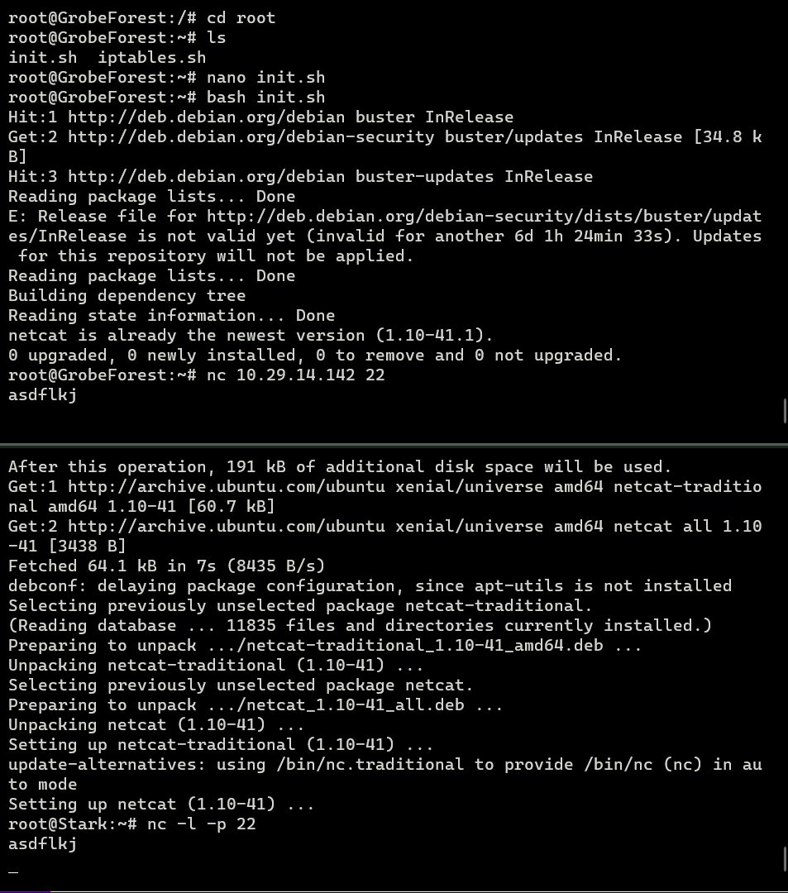

Testing result from hosts outside GrobeForest or Sein:

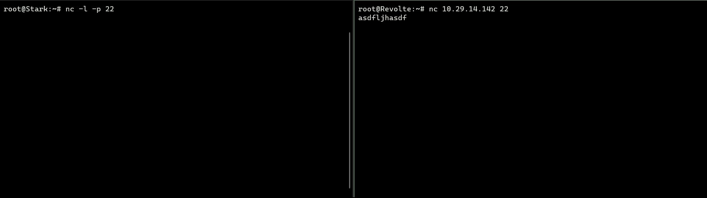

## Question 5

Additionally, access to the WebServer is only permitted during working hours: Monday to Friday from 08:00 to 16:00.

> Solution

To allow WebServer access only during business hours (Monday-Friday, 08:00-16:00), configure IPTables on the web servers (`Sein` and `Stark`):

```sh
# Allow incoming traffic during weekdays (Monday-Friday) from 08:00 to 16:00
iptables -A INPUT -m time --timestart 08:00 --timestop 16:00 --weekdays Mon,Tue,Wed,Thu,Fri -j ACCEPT

# Drop all other incoming traffic
iptables -A INPUT -j DROP
```

> Testing

Change the test host system time to a restricted time:

```sh
date -s "20 DEC 2023 06:00:00"
```

No response from the server:

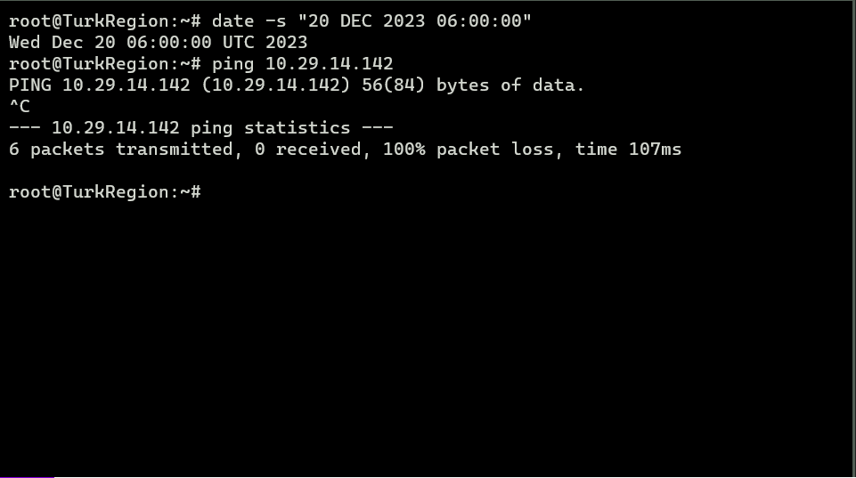

Change the system time to permitted business hours:

```sh
date -s "20 DEC 2023 09:00:00"
```

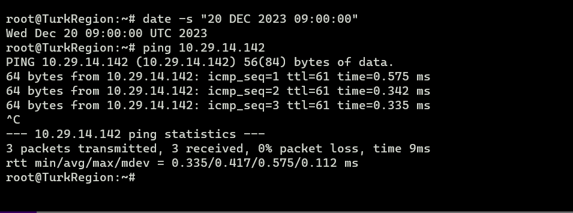

The server responds successfully.

## Question 6

Since the network administrator of the WebServer cannot stand by during lunch and prayer breaks, add rules so access on Monday – Thursday between 12:00 – 13:00 is forbidden (lunch break), and access on Friday between 11:00 – 13:00 is also forbidden (Friday prayer break).

> Solution

To block access during lunch breaks and Friday prayers on the WebServer, configure IPTables on `Sein` and `Stark`:

```sh
# Monday to Thursday from 12:00 to 13:00 is forbidden
iptables -A INPUT -m time --timestart 12:00 --timestop 13:00 --weekdays Mon,Tue,Wed,Thu -j DROP

# Friday from 11:00 to 13:00 is forbidden
iptables -A INPUT -m time --timestart 11:00 --timestop 13:00 --weekdays Fri -j DROP

# Allow incoming traffic on weekdays (Monday-Friday) from 08:00 to 16:00
iptables -A INPUT -m time --timestart 08:00 --timestop 16:00 --weekdays Mon,Tue,Wed,Thu,Fri -j ACCEPT

# Drop all other incoming traffic
iptables -A INPUT -j DROP
```

Complete time-based firewall configuration for web servers:

```sh
# Monday to Thursday from 12:00 to 13:00 is forbidden
iptables -A INPUT -m time --timestart 12:00 --timestop 13:00 --weekdays Mon,Tue,Wed,Thu -j DROP

# Friday from 11:00 to 13:00 is forbidden
iptables -A INPUT -m time --timestart 11:00 --timestop 13:00 --weekdays Fri -j DROP

# Allow incoming traffic on weekdays (Monday-Friday) from 08:00 to 16:00
iptables -A INPUT -m time --timestart 08:00 --timestop 16:00 --weekdays Mon,Tue,Wed,Thu,Fri -j ACCEPT

# Drop all other incoming traffic
iptables -A INPUT -j DROP
```

> Testing

Testing using TurkRegion host:

Set time to Thursday 12:30, then ping Stark (web server):

```sh
date -s "21 DEC 2023 12:30:00"
ping 10.29.14.142
```

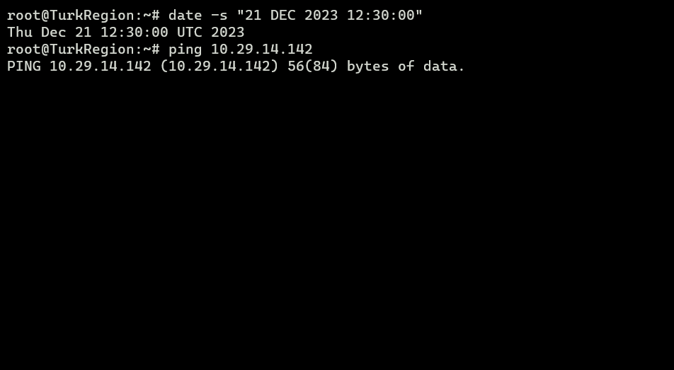

Ping fails as expected due to lunch break restrictions.

Set time to Friday 11:30, then ping Stark:

```sh
date -s "22 DEC 2023 11:30:00"
ping 10.29.14.142
```

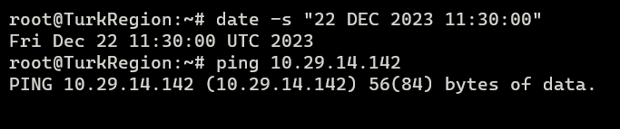

Ping fails during Friday prayer break hours.

Set time to Friday 09:00, then ping Stark:

```sh
date -s "22 DEC 2023 09:00:00"
ping 10.29.14.142
```

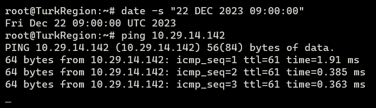

Ping succeeds during working hours.

## Question 7

Because there are 2 WebServers, distribute client requests accessing Sein on Port 80 alternately between Sein and Stark in round-robin sequence, and distribute requests accessing Stark on port 443 alternately between Sein and Stark in round-robin sequence.

> Solution

First, configure Web Server Sein so traffic accessing Sein on port 80 is distributed alternately to Sein and Stark:

```sh
iptables -A PREROUTING -t nat -p tcp --dport 80 -m statistic --mode nth --every 2 --packet 0 -j DNAT --to-destination 10.29.14.142:80
```

Next, configure Web Server Stark so traffic accessing Stark on port 443 is distributed alternately to Sein and Stark:

```sh
iptables -A PREROUTING -t nat -p tcp --dport 443 -m statistic --mode nth --every 2 --packet 0 -j DNAT --to-destination 10.29.8.2:443
```

> Testing

Use netcat on a client host to access `Sein` on port 443:

```sh
nc 10.29.8.2 443
```

Listen on port 443 on both `Sein` and `Stark`:

```sh
nc -l -p 443
```

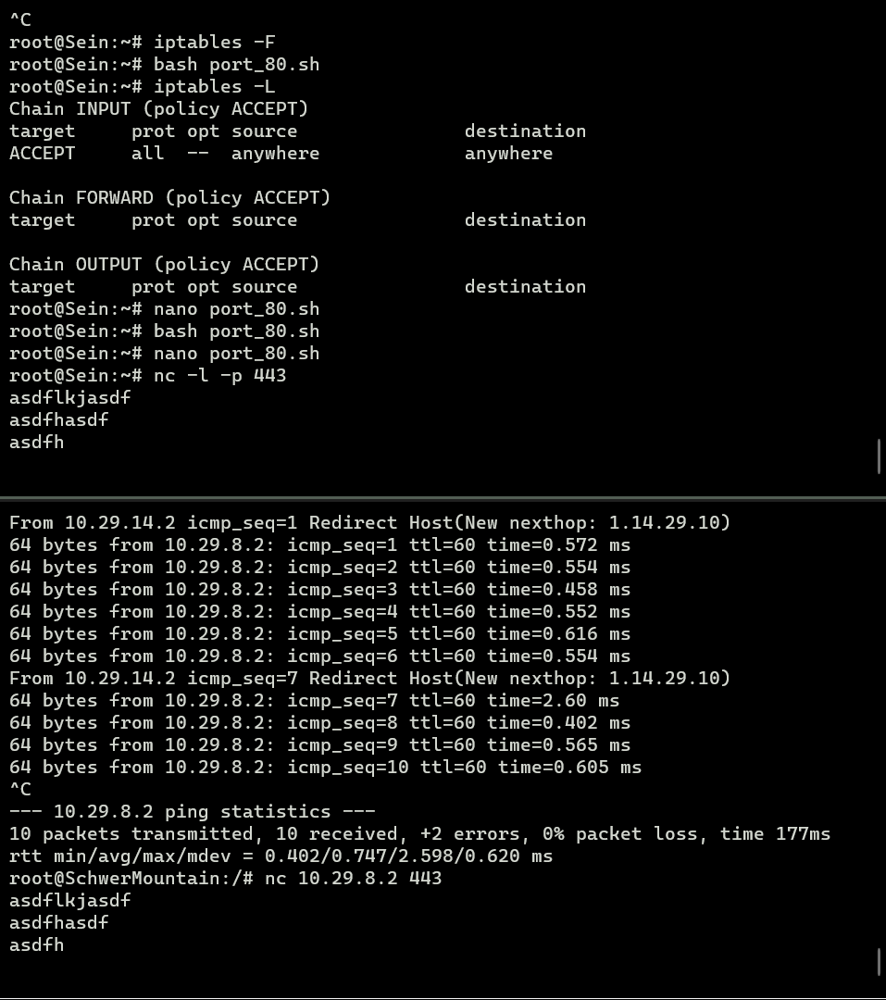

## Question 8

Due to political rivalry, the subnet where Revolte resides is strictly forbidden from accessing the WebServer until the 2024 chieftain election voting ends (which concludes together with the 2024 Indonesian Presidential and Vice Presidential Election: March 20, 2024).

> Solution

Election concludes: March 20, 2024.

To block access to Sein and Stark from `10.29.14.129/30` until March 20, 2024, configure IPTables on Sein and Stark:

```sh
# Drop all traffic originating from Revolte subnet until March 20, 2024
iptables -A INPUT -s 10.29.14.129/30 -m time --datestop 2024-03-20 -j DROP

# Accept all other requests
iptables -A INPUT -j ACCEPT
```

> Testing

Testing using Revolte host:

Set system date to before March 20, 2024, then ping Stark:

```sh
date -s "22 DEC 2023 09:00:00"
```

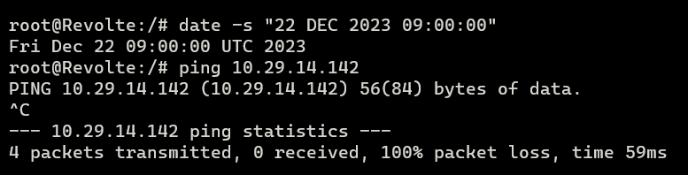

Ping fails as expected.

Set system date to after March 20, 2024, then ping Stark:

```sh
date -s "23 DEC 2024 09:00:00"
```

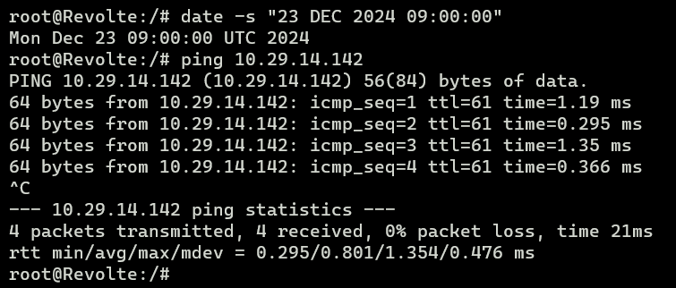

Ping succeeds as the restriction has expired.

## Question 9

To mitigate potential cyber attacks between political factions, the WebServer must automatically block IP addresses performing high-frequency port scanning (maximum 20 port scans) within a 10-minute interval. (Clue: test with nmap or ping)

> Solution

Configure IPTables hashlimit on the WebServer to block high-frequency scan attempts:

```sh
# Limit to 20 requests per hour with burst 20 per source IP, rule named portscan, table entry expires after 10000 ms
iptables -A INPUT -m hashlimit --hashlimit-above 20/hour --hashlimit-burst 20 --hashlimit-mode srcip --hashlimit-name portscan --hashlimit-htable-expire 10000 -j DROP

# Accept other requests
iptables -A INPUT -j ACCEPT
```

> Testing

Test by sending 25 ICMP ping packets:

```sh
ping 10.29.14.142 -c 25
```

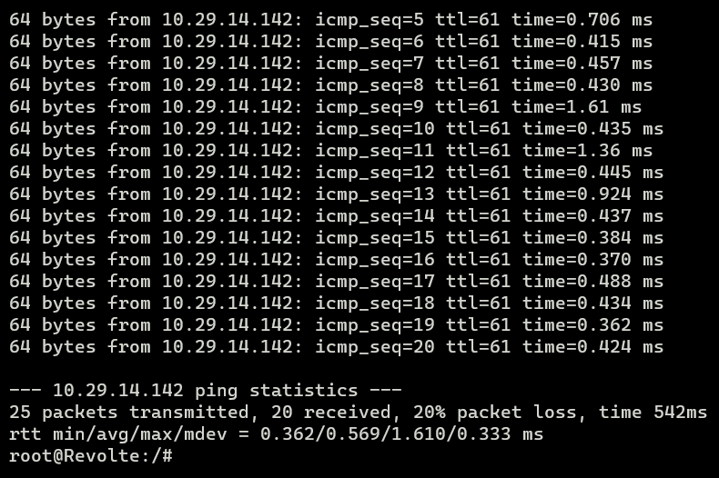

Out of 25 ping requests, only 20 succeed while the remaining 5 are blocked by the rule.

## Question 10

To allow the chieftain to inspect dropped packets, enable logging for all dropped packets across all server and router nodes using standard syslog levels.

```sh
# Log dropped packets to syslog
iptables -A INPUT -j LOG --log-prefix "Dropped packet: " --log-level 6
iptables -A OUTPUT -j LOG --log-prefix "Dropped packet: " --log-level 6
iptables -A FORWARD -j LOG --log-prefix "Dropped packet: " --log-level 6
```
